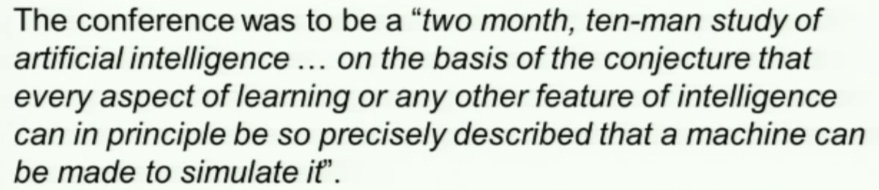

# 4. L4 - Ai achievements
Created Monday 05 October 2020

* Who coined the name AI - John McCarthy, Marvin Minsky and Claude Shannon
* Better names could be - Synthetic Intelligence, heuristic programming, machine intelligence
* The name AI has stuck

*****

* AI started at the Dartmouth Conference in. It was a two month, 10 man study of AI.

* MIT, CMU, Stanford etc were some of the places where AI was being developed.

*****

* Simon and Newell defined the Information-Processing approach for AI. i.e we can work at the knowledge, or information level.
* In other words, all we need is data structures and algorithms which operate on them.
* This is called classical AI or symbolic AI.

*****

Architecture for AI:

1. Symbol - must stand for something meaningful
2. Symbol system - words, arrays, lists, even a tune
3. Physical Symbol System - A symbol system which obeys laws of some kind, a formal system - long division, an abacus, an algorithm

* **The Physical Symbol System Hypothesis** 

* Symbolic AI requires explicit representation of parameters.
* Weights of an ANN are not symbols.

*****

Fear of ML:

1. Frankenstein(Novel)
2. Asimov's laws of robotics(fictitious)

*****

* Chess and other board games were the first
* Recommender systems
* ALVINN
* ASIMO
* KIROBO
* AIBO

