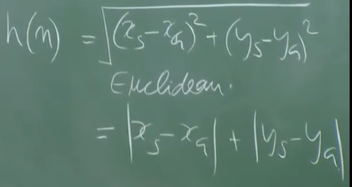
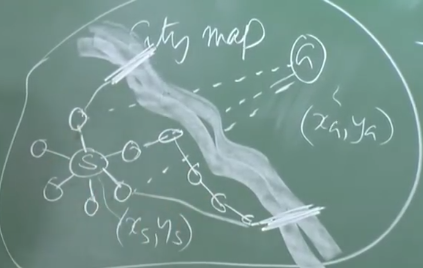
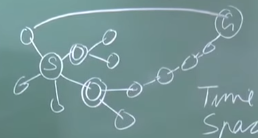

# 1. L9 - Heuristic Search
Created Thursday 08 October 2020

Heuristic Search - Use domain knowledge to guide search.

* We introduce a new function here, called the *heuristic function* denoted by *h(n)* - It is a measure of how easy or hard going from n to goal state is. In other words, the heuristic function helps us select the best move for a given state.
* goalTest() will validate each state with repect to h(goal_state), claculated before hand.

*****

Best First search (heuristic search) psuedocode
	OPEN = []
	CLOSED = []
	while OPEN.empty==false:
		N = OPEN[0] /* pick the best */
		if goalTest(N)==true:
			return N
		OPEN.remove(N)
		CLOSED.add(N)
		merge(OPEN, sort(moveGen(N), h)) /* sort with respect to h()*/

*****

Heuristic functions are of two types:

* Domain dependent(static - i.e look at only one value) - Like Euclidean, Manhattan distance(assuming coordinates are available). O(1) time.

* Domain dependent(non static) - takes into account the surroundings of the current state. Costlier than static heuristic funtion.

Static heuristic function will not take into account the flowing river.

* Domain Independent function - solves a relaxed problem(i.e ignores some constraints of the problem)

*****

Preferred properties of a heuristic function:

* The total cost of search using the heuristic function must be less than a blind search. Heuristic function should be as inexpensive as possible. Ideally O(1)
* The heuristic function must lead us to the goal as efficiently as possible. h() value should be least at each node, preferably.

*****

* Effective branching factor = (no. of nodes seen)/(length of solution)
* EBF = 1 for the best heuristic function, i.e only the nodes in solution are seen.
* Search frontier for Best First Search is zig zag or even discontinuous. Connectedness is irrelevant because we go to the best after each iteration.

*****

Analyzing Best First Search:

* Completness - Yes. Worst case it will explore the entire state space, assuming there are finite space.
* Time Complexity - Depends on the heuristic function. Best case - linear(only required nodes are traversed). Worst case - exponential, just like blind search. Tends to be exponential.
* Space complexity - Depends on the heuristic. Tends to be exponential.
* Quality - Better than blind search. Not necessarily optimal. See diagram below.

Optimal Path was of length 2, but BestFirstSearch found path of length 6

*****

* Heuristic functions are not perfect.

