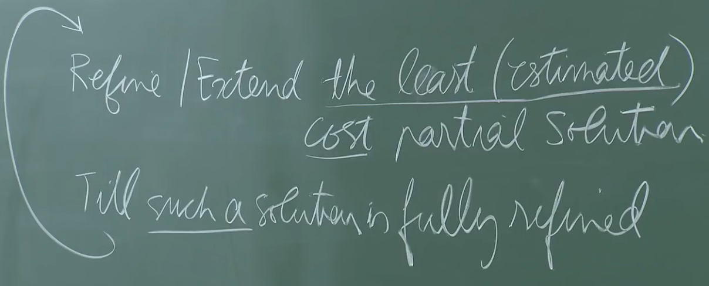

# 1. L 18 - Branch and Bound, Dijkstra
Created Sunday 18 October 2020

* We've looked at State Space Search, Heuristic Search and Randomized Search. Heuristic and Randomized search are not optimal, strictly speaking.
* Heuristic and Randomized are good for finding near optimal solution in a reasonable amount of **time**.
* But if **optimality** is the prime concern. Heuristic and Randomized search are good, but not the best.

*****

**Branch and Bound**
This algorithm does two things, refinement/extension of paths, and exclusion of paths **early** on, with respect to some metric. This is certainly better than the brute-force approach.

The only thing here is to somehow generate tight lower and upper bounds, which can be used for exclusion.

* In TSP, this can be the lowest from each row of the adjacency matrix. This is a very optimistic value, hence it can be treated as a lower bound.
* The termination criteria is simple, if a complete path is less than all current paths(including partial path), then that path is the optimal path.

*****

From now on, the search space is a weighted graph, i.e graphs have a notion of cost.

* Dijkstra is a good algorithm, it is greedy.

*****

Instead of 'cost until now' of a partial solution, we assign an **estimated** cost of the full solution for each node, representing the estimated cost if the node lies in the path at that point. 

* We need an estimation function. Possibilities about the estimation function are:
	1. The function underestimates, i.e c < c^*^
	2. The function overestimates, i.e c > c^*^
	3. The function is perfect, i.e c = c^*^

where c^*^ is the actual cost and c is the estimate

* **Underestimation** is desirable for minimization, because it bounds of unlikely nodes.

*****

Branch and Bound for TSP - short version of Dijkstra

*****

**Refinement Search**

