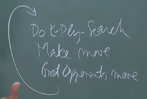

# 2. L27 - Minimax Algorithm
Created Tuesday 20 October 2020

* Checkers << Chess << Go, computing power required
* We create a range of random variables, this gives a quantitative amount of the chance of winning.
* For practical purposes, a partial lookahead works for most activities, and humans have a maximum called an horizon, beyond which we cannot look.
* We need an evaluation function here.
* It's an important conjecture that 16 plies in chess help us play like a Grand Master

*****

Minimax pseudo-code:
	If J is terminal:
		V(J) = e(J)
	Else
		for i=1 to b:
			Generate ji in child(J):
				val = MINIMAX(Vj)
			If i=1:
				V(j) = val
			Else:
				If J is MAX:
					V(j) = max(V(j), val)
				Else:
					V(j) = min(V(j), val)
			return V(j)

*****

How to write an evaluation function:
There are two things:

1. Material = Sum of pieces alive - Sum of pieces of opponent
2. Positional = The positions on the board

