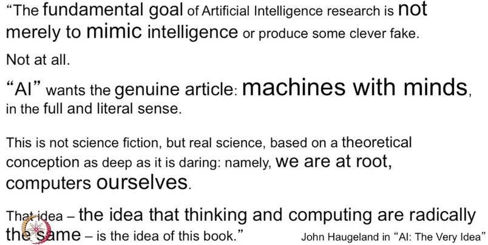

# 1. L1 - What is AI
Created Sunday 04 October 2020

* Humans are satisficers

**Definitions of AI:**

*****

**Definition used by Prof Khemani**

*****

* What behavior can be called intelligent?
	* Decision making, classification
	* Making inferences
	* Communication, language, persistent knowledge(writing)
	* Emotions - but even dogs and cats have emotions, are they intelligent?
* What is a machine, and what is a not a machine?
	* Follows instructions in a well defined manner
* What is thinking?
* Machine vs free will? (Free will is itself disputed)
	* If there is something called pre-destination, then we don't have free will, and are just like computers, made of carbon. After all have a fixed genes gathered from our parents.
* Can machines think?
	* "Intelligence depends upon unconscious instincts that can never be captured by formal rules"
	* Chinese Room experiment - syntax are completely different semantics. Somewhat loosely defined.
	* Roger Penrose - "there's something(quantum mechanical) going in our brains that current day physics cannot explain".
	* "Machines wouldn't be ethical, hence they are not possible"

