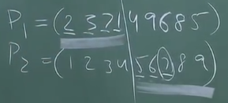

# 2. L15 - Genetic Algorithms
Created Friday 16 October 2020

There are many living species in the world. They compete for natural resources. This competition is called natural selection. Species which adapt persist. It is a biological theory given by Charles Darwin.

* Nature does "generate and test" for the species.
* Nature is thus said to optimize fitness of species, both genetically and physically.
* Fitness cannot be measured. The phrase actually points to the species which persist as being fittest.
* This results in emergent behavior of the world.

*****

* There are two forces in nature:
	1. Generator - Genotype - Sexual Reproduction(genetic mixing)
	2. Tester - Testing of phenotype- Natural selection - Physical situations, social situations, food cycle, accidents(dinosaurs from comets)
* There exists a stable ecosystem
* Competition happens:
	1. Between species
	2. Within the species - Our focus here

*****

* Natural selection causes emergent behavior(making complex systems from basic elements)
* Optimization is achieved by mixing genes and selecting the fittest(by some mechanism)

These methods are called Genetic Algorithms(David Goldberg)

*****

Requirements:

* **Encode** solution as a string(or chromosome) - the population is therefore a collection of strings.
* We need a **fitness function** here, which is not too cost intensive.
* Genetic **crossover **operator
* Mutation function

Algorithm:

1. **Selection** ∝ Fitness - generates children of the existing population

A roulette wheel is made which has sectors for each individual, but the angle is proportional to its fitness. The wheel is spun a certain number of times, and the individual is chosen by this process. The number of times an individual occurs is the mating sessions it will go through.

2. **Crossover** - the generated individuals are mated randomly with one another, only once.

There are many ways to crossover. One simple one is called single point crossover.
A single couple can have multiple children.

3. **Mutation** - We run the selection and crossover multiple times. But this process lacks some genes, which can never be produced, due to parent genes. In order to include these unreachable genes, we occasionally change a gene bit of some individual. This is called mutation. Mutation is random. It is a part of the algorithm only to make it complete.

* After this is done, some 'k' individuals in the original population are replaced by the most fit k members of the newest generation. k ≤ n. This is optional.

The process then continues.

*****

David Goldberg in his books tries to construct an encoding scheme where good genes stay together(i.e persist) and live longer.

*****

Important GOTCHA:
In TSP, we need a sequence where a city comes exactly once. Crossover operators are therefore different for different problems.

