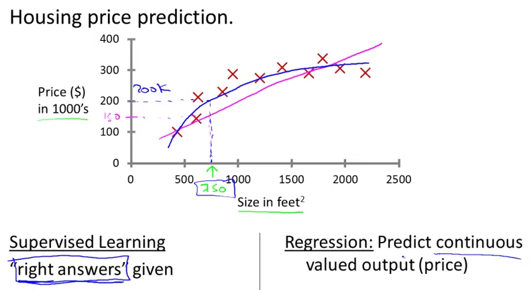
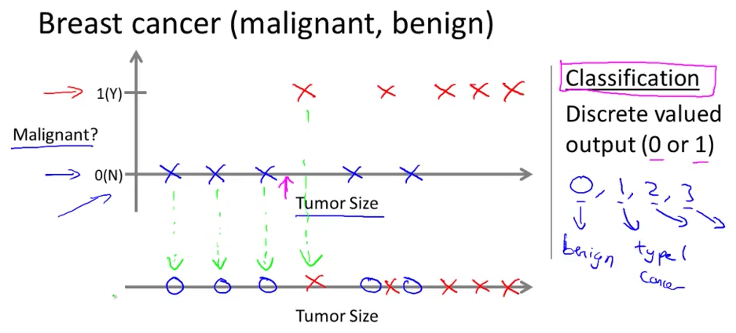
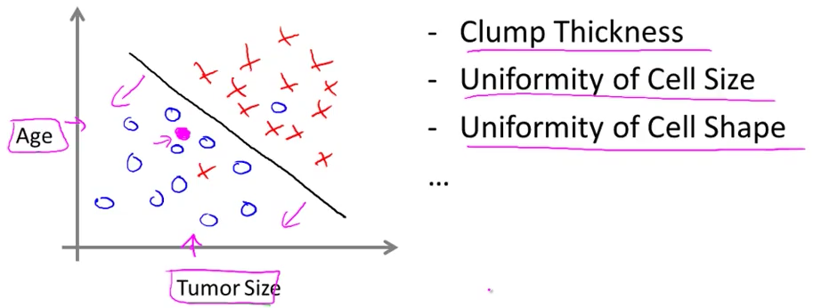

# 2. Supervised learning
Created Tuesday 17 March 2020

* We assume that the input values and the output do have a relation.

Supervised means that we have the "right answers" for many examples, i.e we have a data set.

Supervised learning is **further** **categorized** into:

1. **Regression**: __Output values are continuous.__ 

e.g curve fitting. Prediction based on some attributes. e.g Money is assumed to be a real number, coz are infinitely numbers.

2. **Classification: **Predict the correct answer from a fixed and finite set of answers. Tag/segregate the data into predefined classes. This can be binary or n-ary.

An example can be classifying the severity of breast cancer from the data for the patients. The data can be one attribute or multi-attribute, i.e dependencies. 
*Single attribute*

*Multiple attribute.*

*****

* Support vector machines can deal with infinite number of features(dependencies). It's actually a neat mathematical trick.
* We need to use SVM, because, trivially, there's no way to store an infinite data in a computer, we'll run out of memory, let alone operate on it.

*****

Problem:
You’re running a company, and want to develop learning algorithms for two problems.

Problem 1: You have a large inventory of identical items. You want to predict how many
of these items will sell over the next 3 months.

Problem 2: You’d like software to examine individual customer accounts, and for each
account decide if it has been hacked/compromised.

Should you treat these as classification or as regression problems?

* ☒ Treat both as classification problems.
* ☒ Treat problem 1 as a classification problem, problem 2 as a regression problem.
* ☑ Treat problem 1 as a regression problem, problem 2 as a classification problem.
* ☒ Treat both as regression problems.

