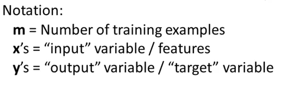
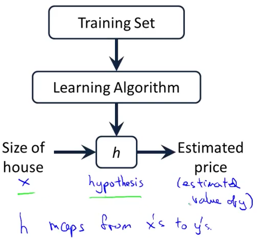

# 1. Model Representation
Created Monday 01 June 2020

(x, y) = one training example - row of the table
(x^(i)^, y^(i)^) = i'th training example - The i'th row

Hypothesis: It's a name that stuck, don't worry about it.

*****

**How to represent h ?**
We define it as:
h~θ~(x) = θ~o~ + θ~1~x, shorthand is h(x)
Linear regression with one variable or univariate linear regression.
Theta terms are called parameters of the model.

