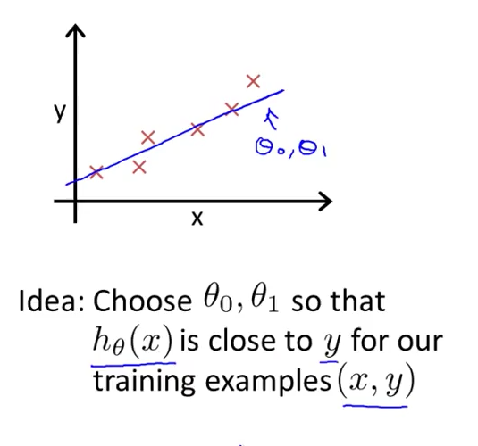
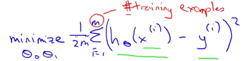

# 2. Cost Function
Created Monday 01 June 2020
 
Cost Function - Lets us know how good a fit is. Takes as input the parameters of the hypotheses. Used to calculate **accuracy**.
 i.e 

* The 1/2 in the mean is a convenience for the computation of the **gradient descent**, as the derivative term of the square function will cancel out the 1/2 term.

*****

We have thus reformulated the problem:
"Find me the values of θ~0~ and θ~1 ~such that: half of the average of the sum of squares of errors is **minimized**.

* This is the cost function.
* We take the OLS, because it is the best for regression. 
* The cost function is called J~O~. Note that J~0~>=0.
* OLS is universal, it does not depend on the hypothesis. Reason: It is mathematical.

