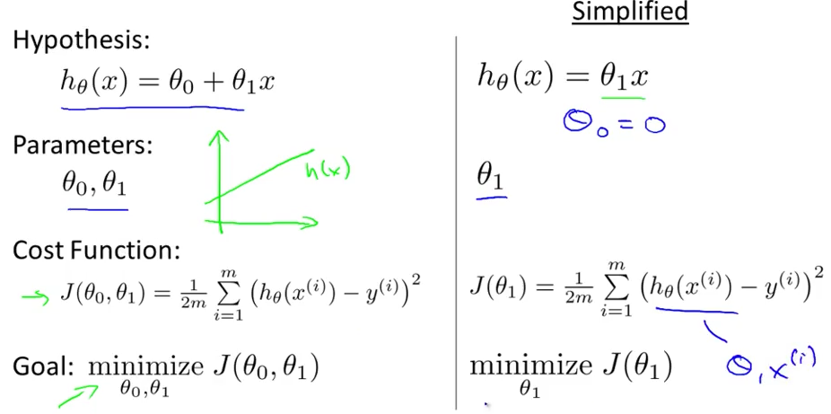
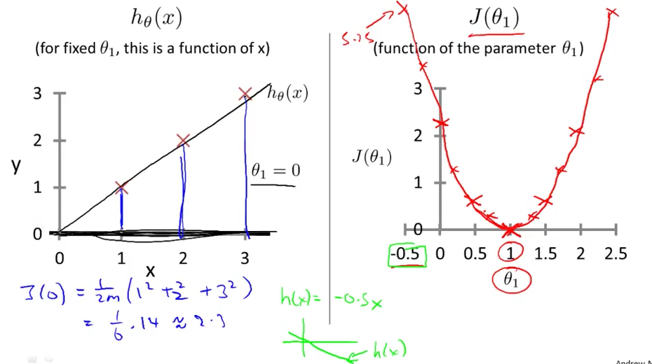

# 3. Cost Function Intuition 1
Created Tuesday 02 June 2020

Hypothesis Function -  Should cover most of the data. Should be the **most **coincident. Fits the data well.
Cost Function - For the correct parameters, when found, it should be minimum.

**In this example, **we've assumed θ~0~ = 0

**What we do?**

