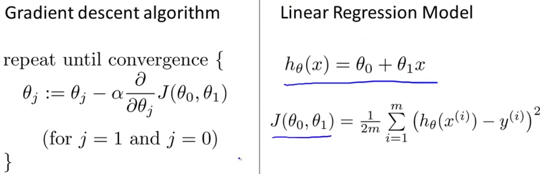
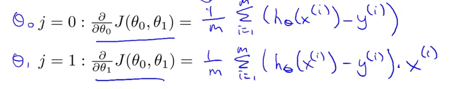
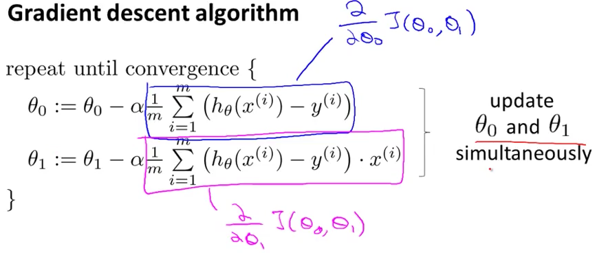
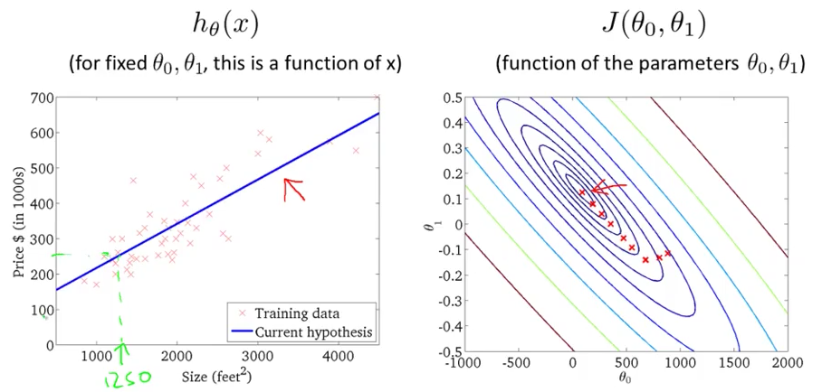

# 3. Gradient Descent for Linear Regression
Created Tuesday 02 June 2020

We have our cost function using the OLS and the way to minimize it, the Graddescent algo.
We use the two to obtain our first ML algorithm.

We just need to find the derivative.
Note: As the y are just constant values, their derivative is zero.
The following is true for a univariate hypothesis.

We can work out the Gradient descent's case for linear regression in one variable as.

*****

* For univariate linear regression, the cost function is always a convex function, so it'll have only one minima, the global minima. i.e It will always converge.

*****

Problem solved !!

*****

* The algorithm we learnt is known as **"Batch" Gradient Descent**, because we use all the values of the training set, in each step. **It is a misnomer, it should be called Whole(All) gradient method**. There are other versions which use a subset of the training examples. We'll study them too.
* There's a numerical solution, a non-iterative one, for calculating the minimum of the cost function, called the **Normal Equations Method**. But gradient descent is better for more data and variables, i.e it scales well.

