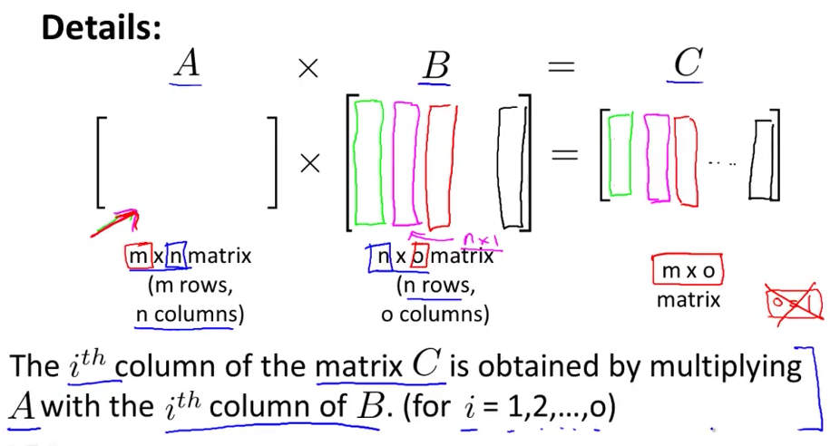
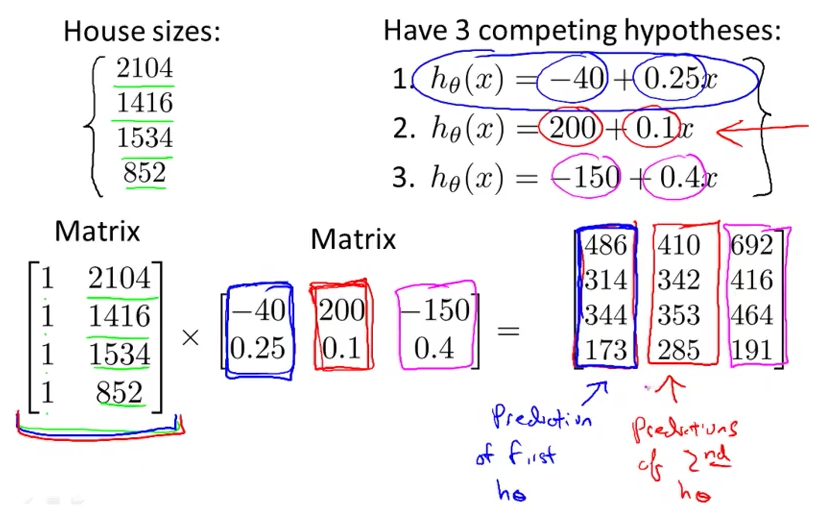

# 2. Multiplication - Matrix, Matrix
Created Wednesday 03 June 2020

Matrix * Matrix represents the substitution considering the second matrix as a vectors written side by side. The product is the matrix, vector products written side by side, i.e we have sets of values to be substituted.
**A * X = B**

* There's a one-one relation between columns of B and columns of C.

We can get the answers: With just one vector algebra multiplication.

* Most programming languages have very efficient matrix libraries, which use parallelism, be it multi-core or SIMD type.
* Multiplication is simple, direct.

