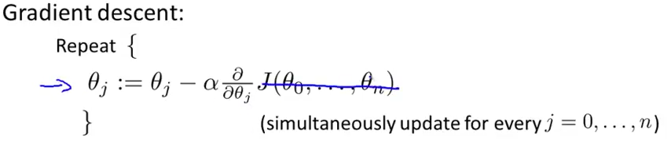
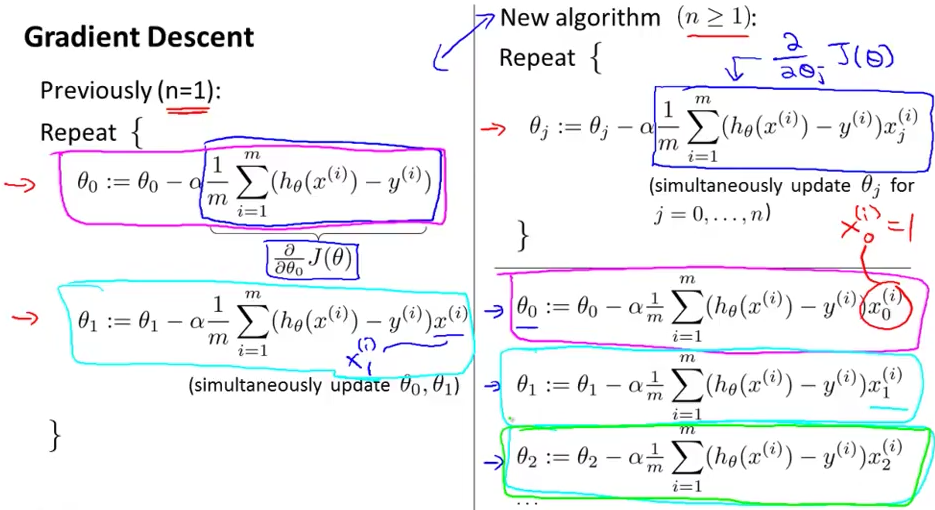

# 2. Gradient Descent for multivariate regression
Created Wednesday 03 June 2020

It's quite simple.

* From now on θ represents the parameter vector.
* We do the derivative of J(θ) for each of the values from θ~0 ~to θ~n-1~.

1. 2 is cancelled, α/m remains.	
2. Degree is subtracted by 1
3. The derivative of the term zeros all the terms except θ~j~, so only x~j~ remains. Features and values are independent, as we can put any values, but the features values will remain the same.
4. The result is analogous to the univariate case, i.e we have x~0~=0 and update every feature simultaneously.

