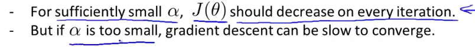
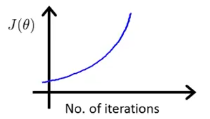
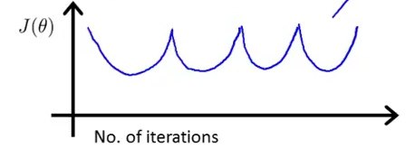
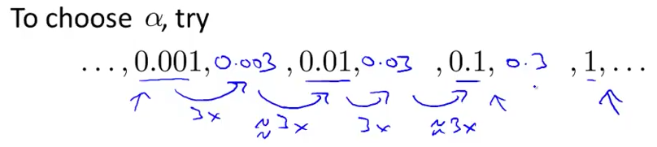

# 4. Gradient Descent in Practice 2 - Learning Rate
Created Thursday 04 June 2020

We know two things for sure:

*****

1. "Debugging" gradient descent, how to - Look at J(θ) vs (θ) plot. 
	1. It's increasing or fluctuating - Use a smaller value of **learning rate**, maybe we are overshooting.

**Note: Number of iterations is not the value on the X axis, it is theta. #of values is what the distance from the origin tells.**

2. It's decreasing, but too slow - increase the learning rate by some amount, to decrease the time taken to reach minimum.
3. It's not changing for a long time - plot and look at the value. Maybe we're at the minimum. **Convergence Test.**

Looking at plots is better than Automatic convergence tests, because its difficult to guess the threshold, ε.

2. How to choose a learning rate α:

We do some smart guessing here. Start from a point, multiply by your favorite number, like 3, and plot J and iterations, we can also try from two different points(which work 🙃️) and finally decide on a value somewhere between them.

