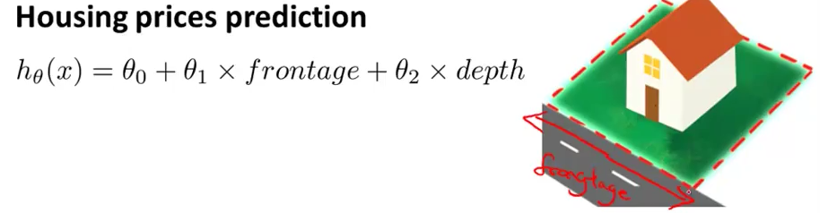
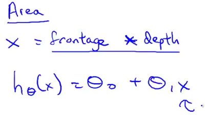
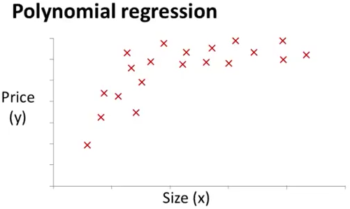
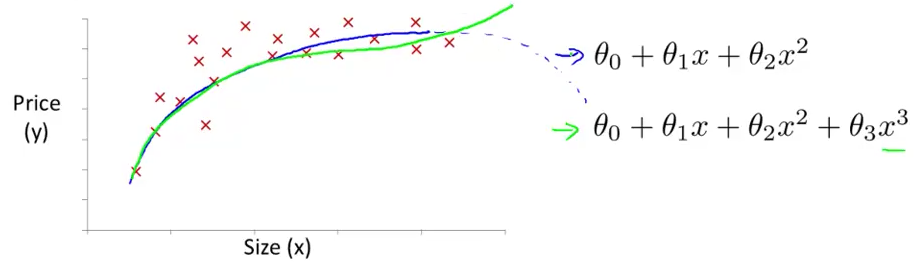
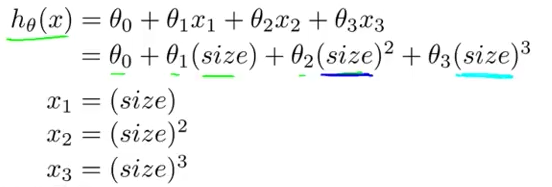
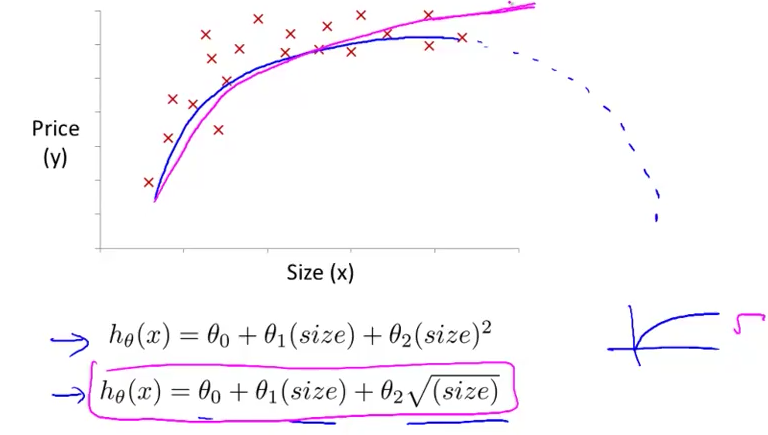

# 5. Features and Polynomial Regression
Created Thursday 04 June 2020

* We can get different algorithms, sometimes very powerful algorithms, by **choosing** the features properly.
* We can use the same machinery as that of linear regression to fit complicated, non-linear functions.

*****

Suppose we have a hypothesis, about housing prices:

But it **seems **that the features are not good, because house area *should* matter more. So we change the hypotheses. i.e **We can combine features to get more meaningful features.**
**Insight **in the problem helps.

*****

Polynomial Regression:
We are given some data about housing prices which looks like this:

Should we use a quadratic model, no, because it'll come back eventually, not correct.

Ok, how do we use linear regression for fitting the model?
We add columns of the new feature, i.e the square and cube terms, and treat them as independent quantities themselves. This way everything becomes linear.

* Scaling becomes very important here. Because we are squaring the terms.

*****

Choice of features:

* How to decide the features in any situation?

There are algorithms, which automatically choose whether we need a quadratic/linear of any other kind of functions.

* Insights about the data are important.

