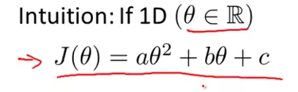
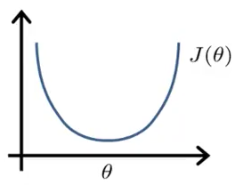
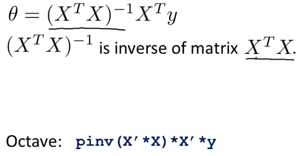
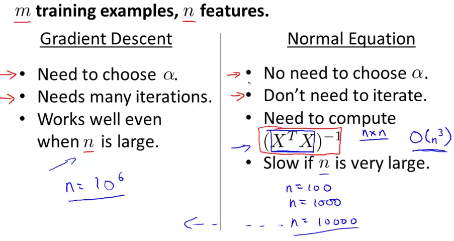
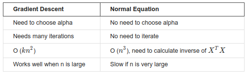

# 1. Normal Equation
Created Thursday 04 June 2020

Imagine that we have a hypothesis:

* We can minimize J by taking the derivative and set it to 0. Then we solve for θ.
* But we have a vector, and not a variable. So we take the partial derivative, n+1 times and find the values of θ.
* In other words we have Xθ = y, where:
	1. X the data matrix - values of the features, from the data.
	2. θ the feature vector - theta, the thing which want to know. This **represents our hypothesis**.
	3. y is the output(values) vector, the values of or y^(i)^.

**Note:** X is a vector, i.e a n x 1. a square matrix, so pre-multiplying by its inverse is impossible(coz the inverse cannot exist). Consequently we cannot open (AB)^-1 ^to B^-1^A^-1^. In order to solve the problem, we first pre-multiply with the transpose. Now X'X is a square. We solve just like AX=B, as in high school.

* Feature scaling is not useful here, because we are not iterating.

*****

When to use Gradient Descent and Normal Equation:

* The heart of the gradient descent is X^T^X, which takes O(n^3^) steps.
* Both algorithms are useful.

i.e We'll prefer using Gradient Descent if features, n>10,000

* The Time Complexity for Gradient descent = mnK = O(kn^2^) which is better than Normal Equation. k is depends on scaling and choice of learning rate. 

