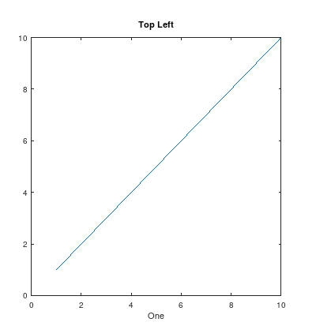
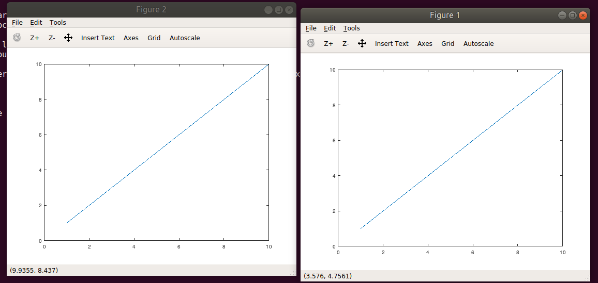
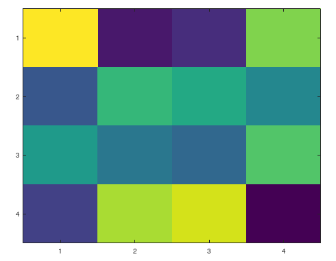

# 4. Plotting data
Created Friday 05 June 2020

* Plots can help in doing sanity checks, i.e everything's going OK.
* They also help in finding hints using which we can improve the algorithm.

*****

**Syntax**: plot(A, B) this plots vectX and vectY's corresponding values. If any of A and B are matrices, the matrices are considered as column vectors. A  = X axis, B =Y axis. Produces 2D plot.

2. hold on; the upcoming plots are drawn on the existing plot.
3. color can be changed, e.g plot(A, B, 'r')
4. xlabel('field') and ylabel('field') are used to label the axes.
5. legend(list of strings) make a legend box on the top right corner, with colors.
6. title('title_of_the_graph') helps to write the title of the graph.
7. We can scale plots using scale([minX maxX minY maxY]), a 1 x 4 vector.
8. clf; clears the plot, but the window persists.
9. close; closes the plot.

*****

8. For making multiple plots on the same window, use subplot(horizontal_blocks, vertical_blocks, current block_ltrd) to first specify the block.

	subplot(2,2,1) # divides the window implicitly to 4 blocks and cursor is at the top left corner
	# all changes below will be drawn in the subplot
	plot([1,2], [1,2])
	xlabel('One')  
	title('Top left')

9. For making plots in different windows, specify figure first.

	figure(1) # has to be an integer, focuses us on the window named Figure 1, creates one if non-existent
	plot(1:10, 1:10)
	figure(2)	# creates a window
	plot(1:10, 1:10)
	figure(1)	# focus back on figure 1
	plot(1:10, 10:1:19)

*****

10. A=magic(6), imagesc(A);  #creates a color matrix, with equal values having the same color.

