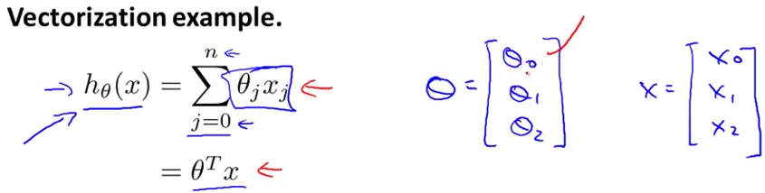
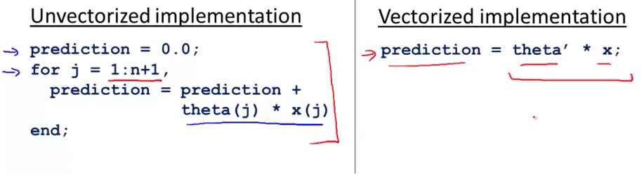
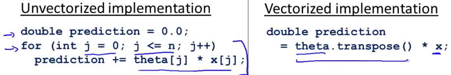
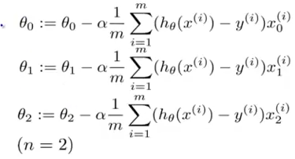
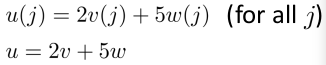
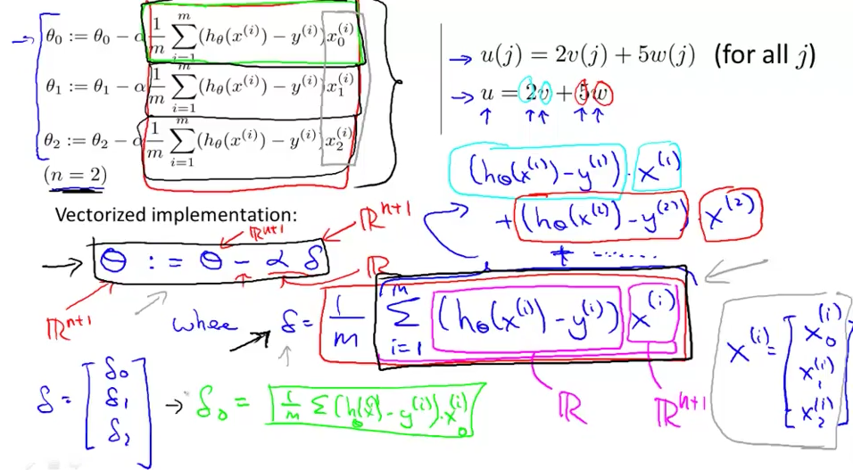

# 6. Vectorization
Created Friday 05 June 2020

* There are special functions for matrices in C/C++/Python which make operation highly efficient.

*****

For finding h~θ~(x) - we can visualize it in two ways, sigma or a prouduct of matrcies. Both operations are the same in essense, but computing them via different methods have different efficiency.

*****

* Unvectorized approach is bug-prone and slow.
* Vectorized approach is very short and has almost no scope of bugs. 

* Vectorization is useful in all programming languages.

*****

Vectorization for gradient descent:

We need a vectorized approach for this, steps:

1. We assume all vectors are column vectors. i.e θ and X^i^ are both 1 x n+1 vectors. i.e X^(i)^~0~=1 for all i.
2. For all the features, we need to update θ~i~ from i = 0 to i=n, simultaneously.
3. We first evaluate the term inside Sigma, this is nothing but (h - y)*x~i~^(i)^, this upon doing algebra, results in being a column. We imagine this column as belonging to θ~i~, for the whole θ vector, we can simply write this as (θ'X^(i)^-Y^(i)^)X^(i)^. We can do this because:

4. The statement, θ - = (α/m) * (θ'X^(i)^-Y^(i)^)X^(i)^ changes for each X^(i)^. This means the factor of θ' will change at each step of the iteration. Consequently, we have no way to further vectorize this eqn.
5. Hence we do 4. from 1 to m. We get our θ vector, and note that all changes are done simultaneously, because the RHS is calculated first, and then it is subtract-assigned to be updated.

*****

	theta-=[0;0;0;0..] # n+1 column vector
	X = [] # the data matrix, n+1*m
	y = [] # a column vector
	m = size(X)(2) # columns
	for i=1:m, # traverses column wise by default, goes from 1 to m
		theta -= (a/m)*(theta'*X(:,i)-y(i))*X(:,i)
	disp(theta)

vectorized implementation makes our 

