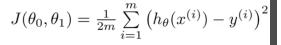

# 1. Vectorized cost function
Created Sunday 07 June 2020
 This is just a definition/
We'll write the vectorized approach for multivariate(the picture shows univariate).

1. We need to sum the values, for each θ, this involves a 1x1 matrix. We need to do this for all j=0 to n. So we can write the equation as

	A = (X*theta-y); # represents h(x)-y is calculated for all j's
	A.^=2; # (h(x)-y)^2 
	J = sum(A)/(2*m);	# J calculated finally

2. In the previous method we had A, and we needed the sum of squares of the corresponding elements. This is also vectorizable

	# assuming X*theta-y is a column vector, i.e n+1 * 1
	# we need a 1 x 1, a value. This is why A'*A and A*A' are not the same.
	J = (X*theta-y)'*(X*theta-y)/(2*m); # 1 * n+1 * n+1 * 1 = 1 * 1

