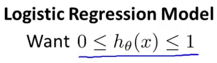
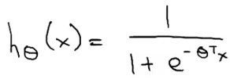
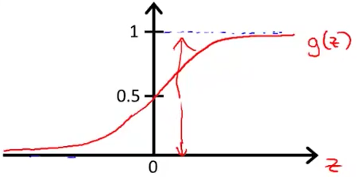
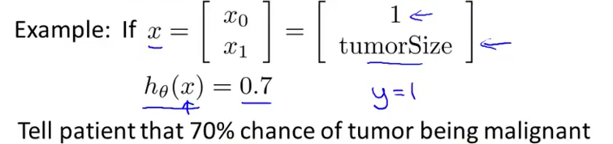
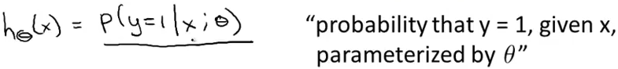

# 2. Hypothesis Representation
Created Monday 08 June 2020

Hypothesis representation for logistic regression(classification) problems:

*****

For classification, we choose h~θ~(x) = g(θ^T^X). Predicted output is the probability.
where g(z) = 1/(1+e^-z^), is the sigmoid function.

* Sigmoid function is used interchangeably with "logistic function".
* The sigmoid function asymptotes at 1 on the right and 0 at on the left.
* It is perfectly symmetrical when changed - water image of one side(+ve or negative) with the other. 		

*****

* We need to fit the hypothesis θ such that the model fits.

*****

#### Interpretation of the h~θ~(x) value

* h~θ~(x) = estimated probability that y=1 on input x.

More precisely,

* Note that P(y=1 | x; θ) + P(y=0 | x; θ) = 1, obvious for a binary classifier.

