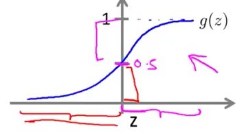
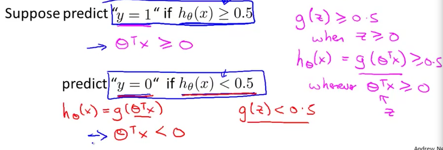
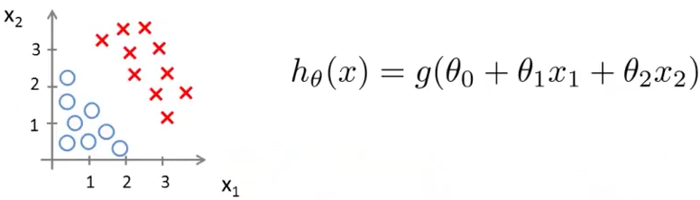
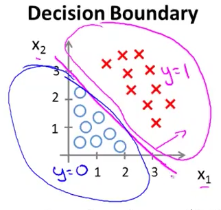
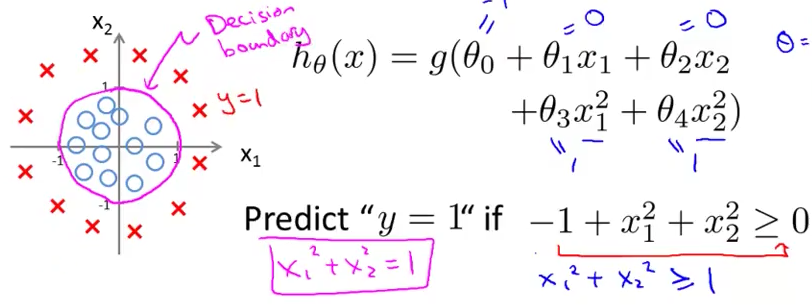
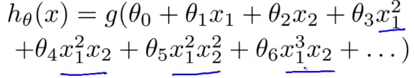
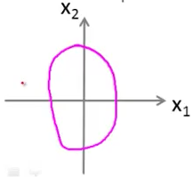
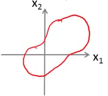
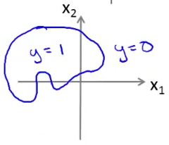

# 3. Decision Boundary
Created Monday 08 June 2020

* We want to understand better when the hypothesis makes prediction 1, or 0.
* If its a binary classifier, we choose h(x) ≥ 0.5 for **y=1**. Else **y=0**. The inclusive term doesn't matter much.

 

*****

Suppose we have this.

Via a procedure(?), we end up with θ = [-3; 1;1]. This is the correct hypothesis. How does it represent?
We know that probability=1 if h(x) ≥	0.5 ⇒ z ≥ 0 ⇒ θ^T^X ≥ 0
This is just -3 + x~1 ~+ x~2~ ≥ 0 ⇒ x~1 ~+ x~2~ ≥ 3; **This line is called the decision line.**
**Probability = 0.5 along this line.**

*****

**Definition:** The **decision boundary** is the line that **separates** the area where y = 0 and where y = 1. It is created by our hypothesis function.

* The hypothesis correctly classifies the data.
* The decision boundary is a property of the hypothesis, and **not of the data-set**.
* After we have correctly made the hypothesis, we don't need to worry about new data points.

*****

**Non-linear decision boundaries**
Decision boundaries can be non-linear, i.e they can make** shapes**.

* We again see that the decision boundaries depends on the hypothesis chosen.

*****

**There are even more** **complex decision boundaries**
We can have ellipses, or any other complex and funny shapes, for complex hypotheses.

*****

This helps justify that logistic regression is indeed an able classifier representation.

