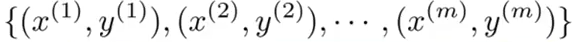
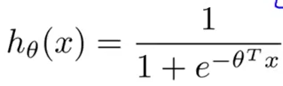
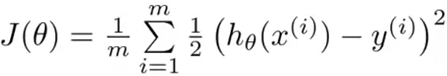
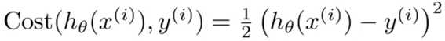
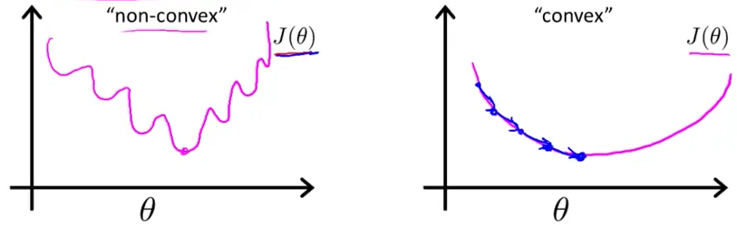
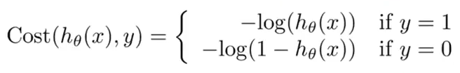

# 1. Cost function for logistic regression
Created Tuesday 09 June 2020

The situation:

* We have the training set 
* We have the hypothesis: a column vector, n+1 x 1 and x~0~=1
* The prediction 

How do we choose the parameters θ ?

*****

When doing linear regression, we used this:

In other words, for a single data point, the **cost contribution** is:

We take the mean for the whole dataset.
We **could** do the same here. Unfortunately, it turns out that J(θ) is a non-convex function here(remember, we are using a sigmoid function as h(x), and squaring the difference is not a good idea 😔️). Gradient descent would be stuck at a local minima, unable to find the optima.

We need a *cost contribution* that makes the cost function *convex*.

*****

* OLS is a good cost function, but it is not useful everywhere.
* There **are **other cost functions.

*****

We choose the following:

This *cost distribution* is **good** because:

1. If y=1, i.e h(x) is very very large(h(x)=1). This means log(h) will be approaching zero. Makes sense.
2. If y=0, i.e h(x) is very very small(h(x)=0). log(1-h) is approaching zero. Makes sense.
3. The minus sign: As 0 ≤ h ≤1 ⇒ 0 ≤ h, 1-h ≤1 ⇒ 0 < log(h), log(1-h)
4. Symmetrical for both positive and negative examples.
5. The penalty value can be from 0 to ∞. It penalizes according to the results, both for the deviation and the value(Positive or Negative). 
6. It is convex. This can be shown, using "Convexity Analysis". It's out of scope here.

* It has all the desirable properties. We'll use this.

