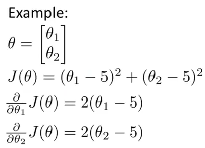
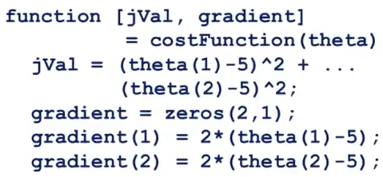
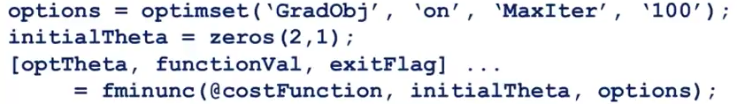

# 3. Advanced optimization algorithms
Created Tuesday 09 June 2020

We'll be able to run logistic regression algorithms faster and also scale for a large number of features.

*****

For gradient descent, we have to compute the derivative term. And also keep track of the cost function.
There are other algorithms for optimizations.
These include:

1. Conjugate gradient
2. BFGS
3. L-BFGS

*These are well beyond the scope of this class.*
**Advantages**

1. No need to manually pick α - They have a clever inner loop in the process, called a *line search algorithm*, which can even pick a different learning rate for each iteration.
2. Often faster than gradient descent. 
3. Converge much faster than batch gradient descent.

**Disadvantages**

1. More complex, so difficult to implement.

**Tips from Andrew**: 

1. These algorithms can be used even without knowing their implementation. Also, he as a professor, used them for over a decade before learning the details.
2. Implementing them is not a good idea unless we have a solid understanding of numerical computing.
3. We should use them as software libraries.
4. Octave and MATLAB has a good library of these algorithms.
5. There are good and bad implementations of these algorithms, so we should try different libraries when we develop using C++, Java, Python etc.

*****

Minimize this:

The answer is obviously [5; 5]
But if we had to use an algorithm to find the correct hypothesis, we'd do it this way:

1. First define the cost function and the gradients - This will calculate the derivative and the cost function.

2. We'd call the advanced function **fminunc**, which *just *returns the required theta(solved).

* optimset() return a data-structure for the modes/options.
* 'GradObj' , 'on' - means that we'll provide a gradient to the algorithm,in addition to the cost function.
* 'MaxInter' is the maximum number of iterations.
* fminunc - find minimum unconstrained, '@'symbol means that we give the pointer to the function. Unconstrained means that all theta values ⊂ R.
* optTheta - This is an empty value of θ, for storing the hypothesis.
* functionVal - An empty variable, which stores the minimum cost function, i.e during convergence.
* exitFlag - returns 0 if we converged successfully. Otherwise 1.

Note: fminuc should be applied to data which is having atleast 1 feature

*****

Advanced optimization algorithms:

* We just need to write code to compute the **cost function** and the **gradient**(optional).
* And give the **data set**.
* We **don't **need to provide the **learning rate**, the advanced function takes of it.

