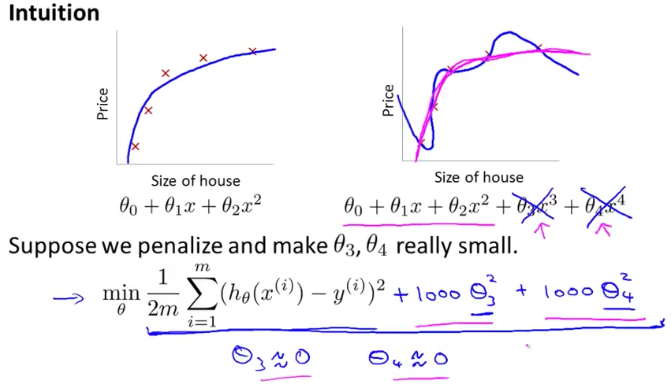
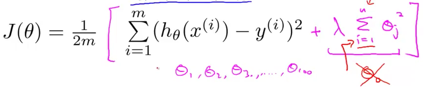
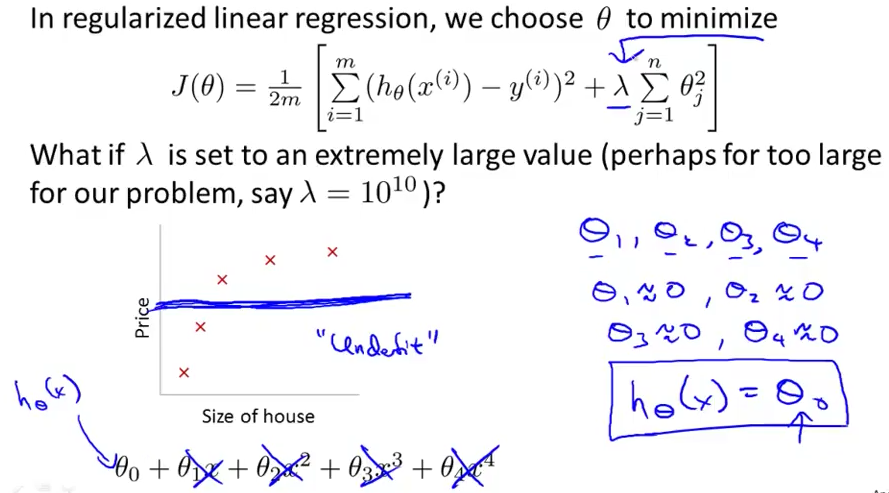

# 2. Regularization - Cost function
Created Wednesday 10 June 2020

* We can decrease the effect of some parameters. By explicitly setting their x~j~ value to a large value, the corresponding thetas will have to be very small as we are minimizing, thereby decreasing their contribution. This results in a simple hypothesis. 
* In other words, we penalize some parameters.

 

* Smaller values help in making simpler hypothesis is **similar** to making the concentration of a reactant very high in order to figure out the unknowns, by making the high ones having no(little) effect, in chemical kinetics.
* We take squares, as it's analogous to square of the distance. **MAID**

*****

* Note that we are adding the theta values directly to the J(θ) term. (J(θ) is the one being minimized).

* This is called the **regularized cost function**, the lambda term is called the regularization term.
* θ~0 ~is not regularized.
* This expression has two goals:
	1. 1st-term: Usual, fit the hypothesis.
	2. λ	term - Avoid overfitting.

*****

If λ is too big, underfitting occurs. The hypothesis is said to have a **very strong preconception**.

Later in the course, we'll study about techniques that automatically choose the **regularization parameter** (λ).

