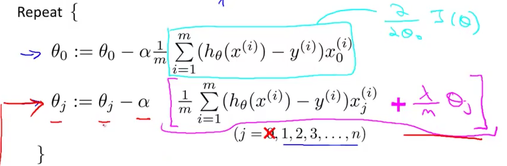
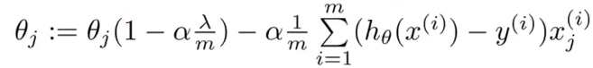
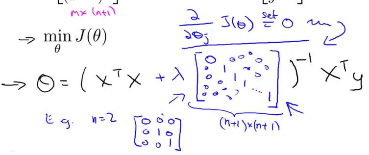
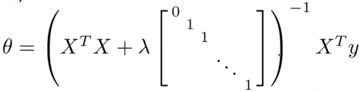

# 3. Regularized Linear Regression
Created Wednesday 10 June 2020

We have the regularized cost function:

We just need to take the derivative. Also θ~0~ is handled separately.

This can be simplified to:

*****

An interesting observation:

* The update is decreasing the θ~j~ even more, as (1-α*λ/m) is always less than one. Also, we are subtracting the second term, as usual. This clearly **speeds up** the process. But the end goal is different from the one if there was no regularization. This is okay as we **want** to dilute θ contributions, in order to fit the data nicely.

*****

Using regularization and Normal Eqns method.

* We had θ = (X^T^X)^-1^X^T^Y without regularization.
* We want to minimize J(θ), so we set each of its derivatives to zero.
* No regularization for θ~0~

The lambda term is a n+1 x n+1 matrix.

*****

Non-invertibility:

* If m<n, X^T^X will be singular or degenerate i.e non-invertible. pinv may or may not help here.
* If m=n, X^T^X may be singular.
* Regularization also takes care of these, and other rare non-invertibility issues because the λ term makes the (X^T^X + λ[0; 0 1;0 0 1; ...;0...1;]) term always invertible.

