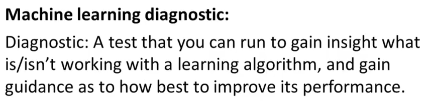

# 1. Deciding what to try next
Created Saturday 20 June 2020

* By now we've seen a lot of learning algorithms.
* We should consider ourselves experts in ML.
* But it's a different thing to apply the algorithms to solve problems.

There are many things we can do, in no particular order:

1. Get more training examples. - **Very expensive - Both ways, time and resources.**
2. Try smaller set of features. Careful selection. - **Very expensive to decide which ones to keep.**
3. Try to get additional features, the current features are not enough.
4. Try adding polynomial features.
5. Tweaking λ.

* Most people do this by their gut feeling. Randomly.
* Fortunately, there's a technique which can help rule out many of the things which are possible, but not feasible:
	1. Machine learning diagnostics

Diagnostics can take time to implement and be pretty complex, but its a very good use of our time. They definitely don't take 6 months.

