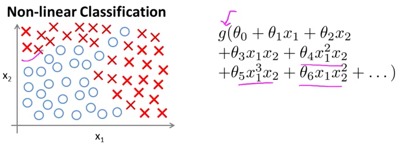
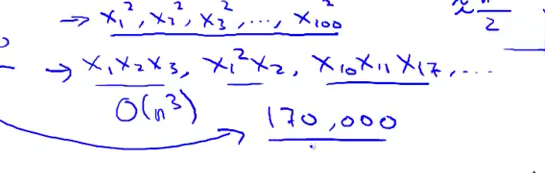
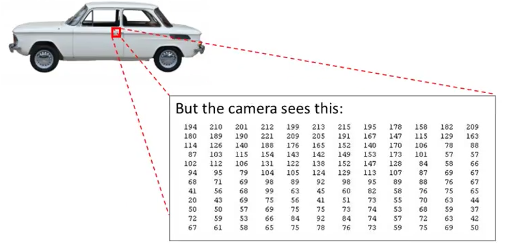
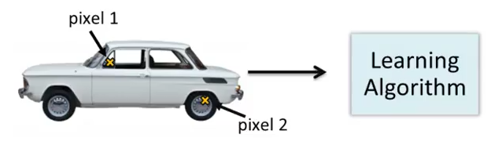
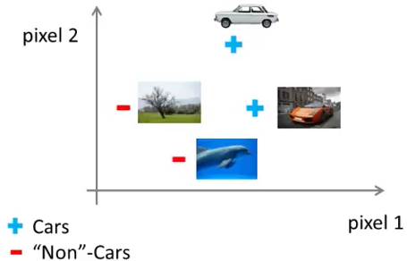
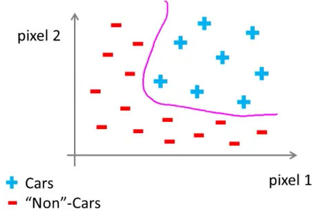
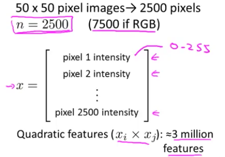

# 1. Non-linear hypotheses
Created Friday 12 June 2020

* We'll learn about an ML paradigm called Artificial Neural Network(ANN).
* It's old.
* It was popular at a time, then died down, then resurged. It is now accepted and used as a state-of-the-art ML algorithm, partly due to the increase in computing power, which makes it much more practical now.

*****

Why do we need ANNs, if we already have linear regression and classification algorithms?

* ANNs are useful where the hypothesis are complex and/or non-linear.

This is okay if the number of features are less.
Example: For housing prediction, we can come up with a lot of features ~ 100. If we were to include all of features with a maximum degree of 2. We'd have around 5000 features.

* For n features and maximum degree r, number of terms = ^n^C~1~+^n^C~2~+ ... + ^n^C~r ~= O(n^r^/r!)

Problems with this:

1. Overfitting is very likely to occur.
2. Computationally very expensive. O(kn^2^) = O(kn^2r^) ~ exponential, as r >>1
3. Decreasing the features will simplify the decision boundaries, and so it is nearly impossible to get such an intricate classifier. Even for small values of r, because n will be very large.

*****

For many ML problems, n is pretty large. e.g Computer Vision

* This is because each pixel is a feature. And even if we take a small part, say the door handle of a car, a x * y image. n becomes = x*y, that too for a grayscale image.
* The computer/camera sees a pixel matrix.

*****

Let us make a classifier for detecting whether the picture is of a car or not.

* We'll first choose certain parts of which will act as our features.

* The dataset can be represented as:

 the outcome should be 

* The number of features is very high:

*****

It can be concluded that *these applications* cannot be solved by using regression(logistic in this case).

