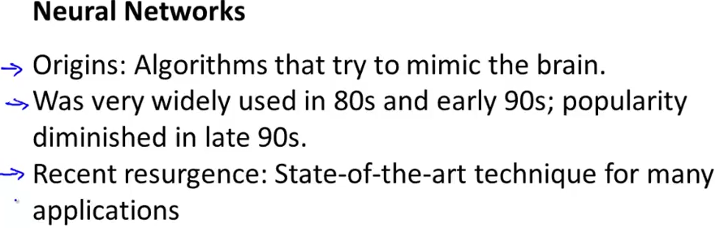
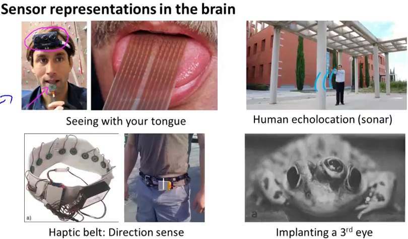

# 2. Neurons and the brain
Created Friday 12 June 2020

* ANNs are pretty old.
* The goal is to make machines that mimic the human brain.
* Professor Ng is teaching ANNs because they are helpful in various scenarios and not just because of the logical motivation. This is not just a theory.

*****

One of the reasons for the resurgence is because computers have become fast enough. There are other reasons too.

*****

Our brains are amazing, they can:

1. Learn to see, hear, touch.
2. Learn to do math, calculus.

**It seems that to mimic the brain, we'd have to write a thousand different programs, each of which performs a so-called elementary function.**

But, there is an alternate hypothesis.

**Evidence for the hypothesis**:

1. We hear because the sound from the ear gets to the auditory cortex. Neuroscientists have performed an interesting experiment, in which they cut the wire connecting the ear and the auditory cortex. And instead connected the optic nerve to it(auditory cortex). Eventually, the auditory cortex learns to **see**, and this is really just like we see.
2. The same thing was done for the somatosensory cortex, which learnt to see when the optic nerve was routed to it.
3. Various other neuro-wiring experiments have reported such behavior.

**Conclusion:** If different parts of the brave can learn to do elementary functions of other parts, then it's very likely that **the learning process** is a general phenomena for brain cells, and **not mutually exclusive** to the parts. **In other words**, we just need to figure out **the single learning process** of the brain, enabling us to mimic every part of the brain. A machine can then be taught by giving examples, just as the brain does, without any prior experience. This way, a machine can mimic the whole brain, essentially **behaving just** as we do.

*****

There are many other examples where representation of a seemingly new task is learnt by *organs* which don't have any prior experience of doing the task.

* The tongue learns to see in about 10 minutes when electrodes from a grayscale camera are connected to it. The electrodes send the image data as a pattern of voltages.
* Human echolocation - auditory cortex learns to precisely act as SONAR.
* Haptic belt - The belt has a compass and buzzes whenever pointed NORTH. After wearing it for a few days, the person is able to determine the direction without the belt. This is just like some birds know the directions.
* The 3rd eye is routed to the visual cortex, and the frog is able to use it for sight, after a while.

*****

It's amazing how the brain, when given sensor data(of any type) can learn and work with the data.

* Mimicking the brain looks like the right direction towards the AI dream, if we can figure out the algorithm for doing so.
* Professor Ng is not teaching ANNs only because of these evidences, but also the fact that ANNs have proved to be good at many complex tasks. He personally has an interest in them. That being said, we are not sure if ANNs are the **only** sure-shot way towards the AI dream.

