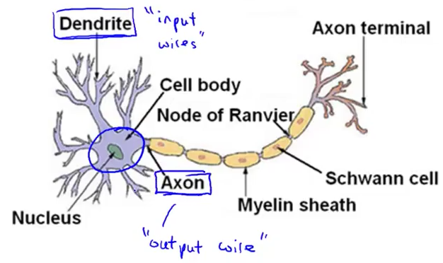
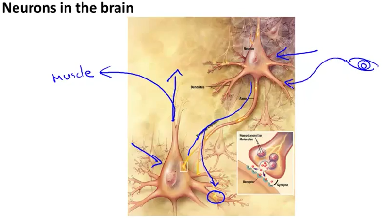
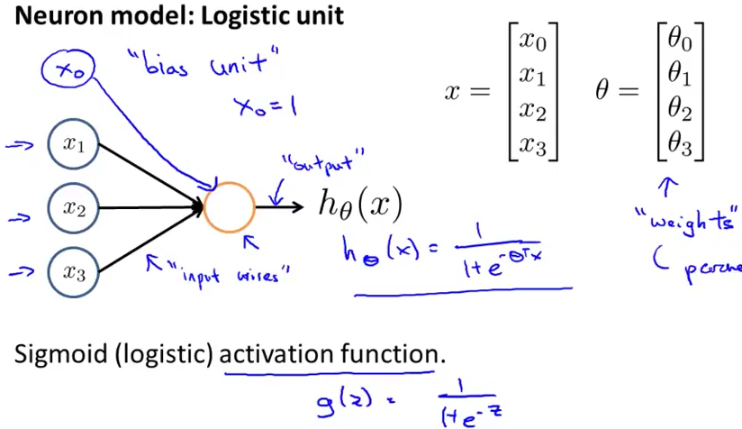
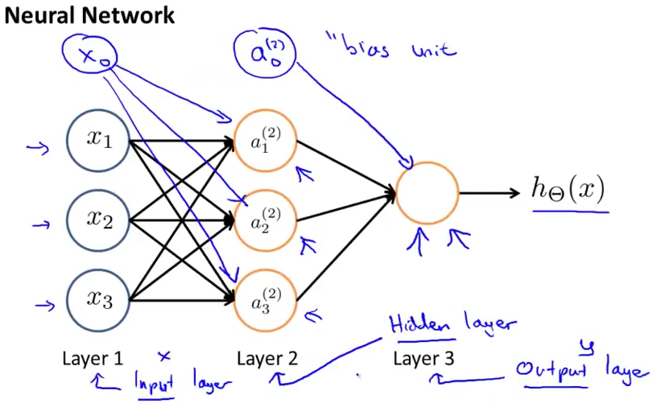
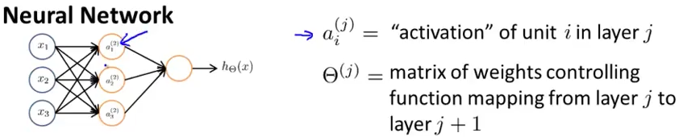
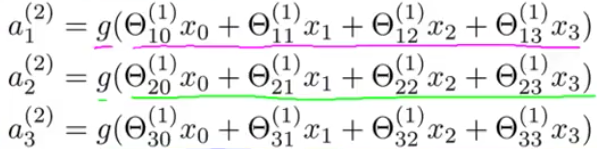
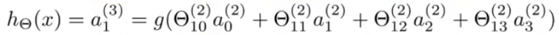

# 1. Model Representation 1
Created Friday 12 June 2020

How do we represent our hypothesis using ANNs?

*****

### The Brain and Neurons

* Our brains are jam-packed with neuron(brain cells). They are the primitive units of the brain.
* The neuron has three important parts:
	1. Input wires - Dendrites
	2. Processing unit - Nucleus
	3. Single output branch - Axon

* So a neuron is basically a **computational uni**t of the brain which takes several inputs, does some computation and sends **an **output to another neuron.

*****

### Neural Network

Communication between neuron happens in the following way:

* Inputs are sent to the dendrites of a neuron via short electrical pulses, also called spikes. The neuron does some computation based on the inputs, and transmits the output to another neuron. 
* This is how all thinking happens in the brain.
* This is also how the senses and muscles works: transmitting sensory data(to a neuron) or receiving input for movement from a neuron.

*****

### An Artificial Neuron

* The neuron is modelled as a **logistic unit.**
* We feed data to the neuron via the dendrites - input values for the **features**.
* Representing the **bias unit**, x~0~=1 is optional, it is always assumed to be present, in every layer.
* Parameters of the model are interchangeably called **weights **in context of ANNs. They are the same things.
* The neuron does *some *computation, and returns the hypothesis function, h~θ~(x) = g(θ^T^x) = 1/1+g(θ^T^X). It is also called **sigmoid**(logistic) **activation function**. Symbolized non-linearity.

*****

### Artificial Neural Network(ANN)

* ANN is a group of neurons **strung** together.
* A '**layer'** is a group of neurons which are at equidistant from the data. Same generation.
* The first layer is called the **input layer**. Its neurons represent the feature values(for a record(DBMS) of data), itself. It does **no computation**, just passes the data ahead.
* The final layer is called the **output layer**. It is a **single** neuron.
* Each neuron takes as input **all values** from some/all of it's parent layers.
* Except the input and output layers, all other layers are called **hidden layers**, because their inputs and outputs are never kept track of/seen during IO of the ANN as a whole.
* The hidden neurons are also called **activation units/nodes**.

*****

### Working of an ANN

**Jargon**:

* a~i^{(j)~ }- the output of the ith neuron in the jth layer.
* Θ^(j)^ the weights matrix from the jth layer for the (j+1)th layer. Capital Theta. Each row is the weight for an activation unit in the next layer. Consequently order = s~j+1~ x (s~j~ + 1). Plus 1 is for the bias weight.

The value of the activation units is calculated like this:

And the final output is calculated this way.

