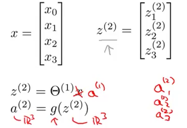
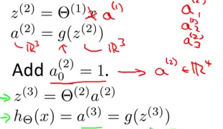
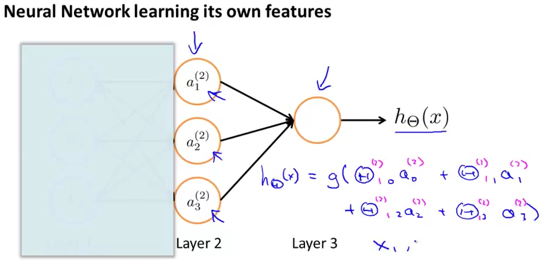
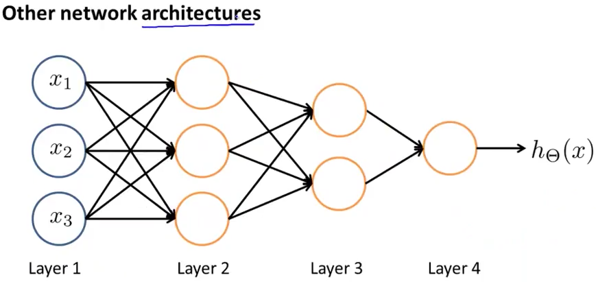

# 2. Model Representation 2
Created Sunday 14 June 2020

Jargon:

* Define z^j^~i ~as the input of the sigmoid function for a^j^~i~

We can see that
z^(2)^ = Θ^(1)^a^1^, where a^1^ = x
a^(2)^=g(z^(2)^)
We're doing element wise sigmoid.

*****

The bias unit, is **added** at each step:

This helps in vectorizing the computations.

*****

This is called forward propagation.

If we cover all the layers except the last hidden layer and the output layer, we can observe that we are in essence doing nothing but logistic regression, the only difference is that we're not doing it on the original data values. Rather we are using a1, a2, a3. **And**, they are themselves learned by some other **a**s from the previous layer. The features yield more complex features as the propagation progresses.

This method yields better hypothesis and is good for complex non-linear hypotheses. Its the flexibility here, that makes it so powerful.

*****

Neural networks can have different architectures - and are not constrained to having the same number of units in each layer.

