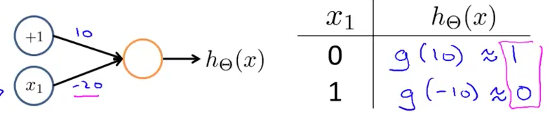
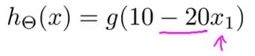
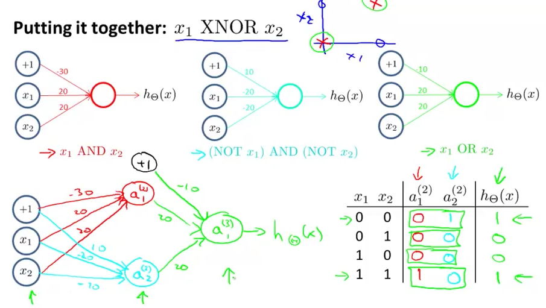
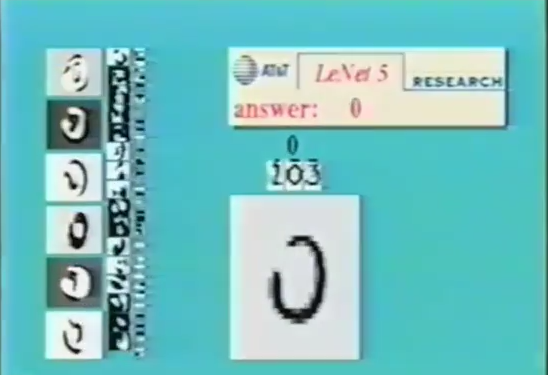
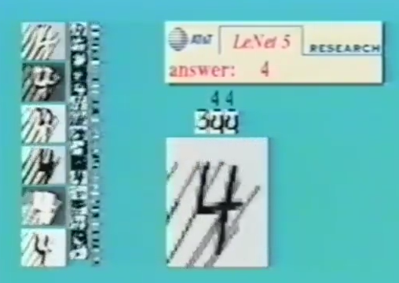
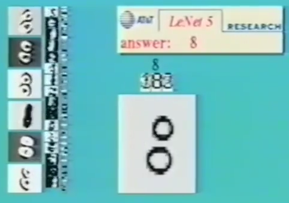
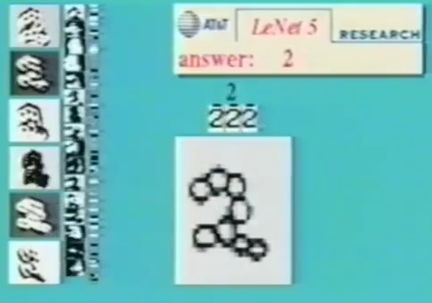
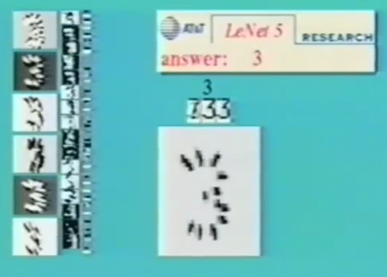
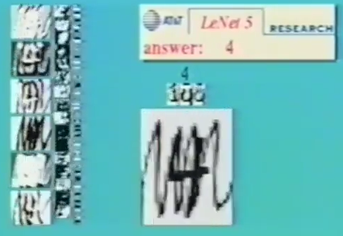

# 2. Examples and Intuitions 2
Created Sunday 14 June 2020

We can also compute negation.

To negate a feature - make the corresponding **weight ***negative.*

*****

We have made the AND, OR and the XNOR.
We use them to make the ANN which classifies the example.

* We now have a non-linear decision boundary which can now model complex functions.
* Complexity increases with each layer.

*****

ANNs are very good at complex hypotheses, like handwritten digit recognition. It can even catch multi-digit, and shadowing, light obstructions, partially written digits etc.
  
  
 

