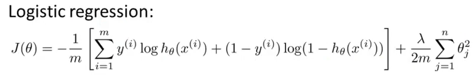
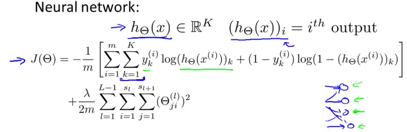

# 1. Cost Function and Back-propagation
Created Sunday 14 June 2020

We'll focus here on ANN classification.
Jargon:

* L - total number of layers in the network
* s~l~ - no of activation units(not counting the bias unit) in layer l
* 1 based counting
* k = number of classes

*****

Conditions for ANN

* The output layer has k activation units and no bias unit.
* The correct answer is a k dimensional row of a single 1 and all other zeros, hopefully.

*****

Cost function:
For ANN, the cost function is a **generalization **of the cost function for logical regression.

For the ANN, we have:

Here:

1. 1st term: sum of cost functions for each **final** output in the ANN, for each of the classes. Very intuitive. The k=1 to K is there because each data row has 4 outputs(one 1 and rest zeros - **one vs all**).
2. 2nd term: Regularization term: Minimizing the sum of squares of all(anywhere) **weights**(parameters), except the bias weights. l=1 to L-1, because **Θ^L^** is absent, as it is the final layer. s~l~ and s~l+1~ are the orders. **Same** as that for linear and logistic regression.

Note: If we do regularize the bias, in the cost function only(not in the gradient), we might get a similar answer. But it's a convention to avoid regularizing the bias term.

