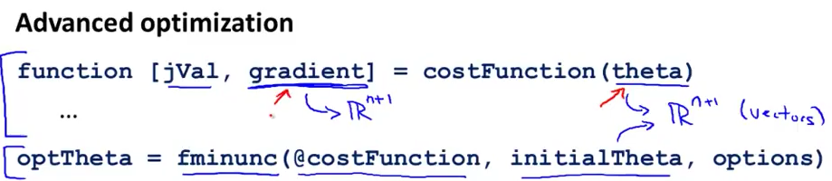
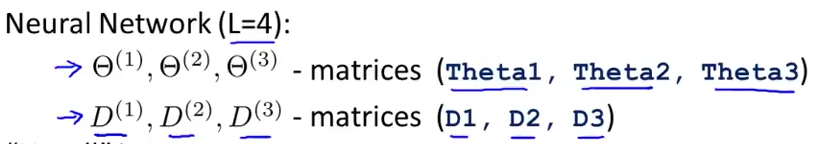
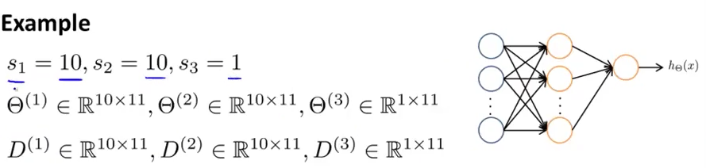
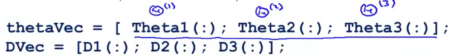
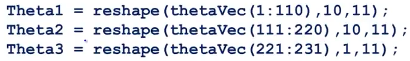
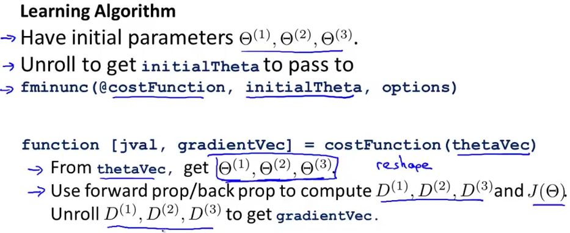

# 1. Implementation Note - Unrolling parameters
Created Friday 19 June 2020

In advanced optimization, 

* The 'theta' given is considered a vector(number of parameters)
* The gradients are also considered vectors.

But in ANNs, we have parameter matrices(Θ^(l)^) and gradient matrices(D^(l)^). 

To use fminunc, we need to **unroll** the matrices into vectors. Like this:

Unrolling them:

To get back the vectors we do this:

*****

The whole process is:

1. We have our initial parameters(matrices) for parameters.
2. We unroll them.
3. Cost function and derivatives are calculated.
4. Derivatives are unrolled to get the gradient matrices.

