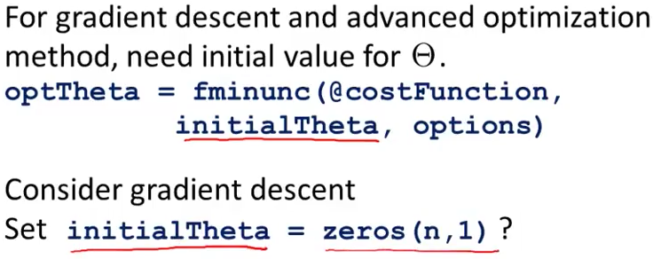
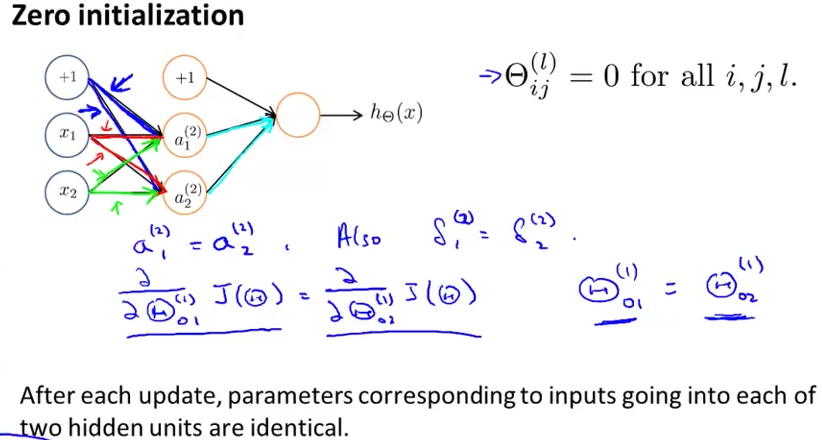
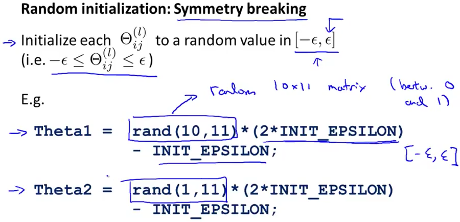

# 3. Random Initialization
Created Saturday 20 June 2020

* This does not work, as far as ANN's go. It may work for logistic regression.

1. All activation units of a layer will have the same value.
2. All the error in the layers will also be the same.
3. Weights emanating from an activation unit will be the same for all recipients.
4. The derivatives are all the same.
5. We go about in cycles - and the redundancy leads to the ANN not learning interesting. It focuses only on some aspects.

*****

Using random initial values actually breaks the symmetry.

* This ε has nothing to do with gradient checking..

