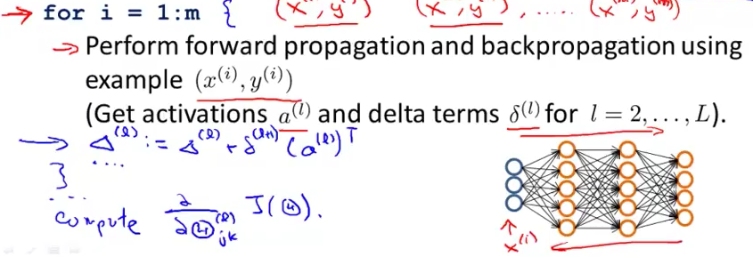
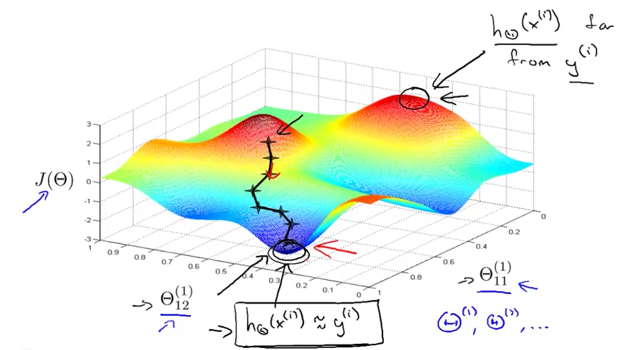

# 4. Putting it together
Created Saturday 20 June 2020

The overall process of implementing an ANN.

1. Pick a network architecture - layers and number of units in each layer.
	1. Number of input units = same as the number of values in a data example
	2. Number of output units = number of classes. For binary classification, one output unit is enough.(>0.5 for Yes, else No)
	3. Number of hidden layer: One layer is a good default. Using more layers makes our predictions better, but computation time increases.
	4. Number of units in a layer: It is good to have the same number of units in each layer, and comparable to the input layer.

 

2. Training a neural network - the code.
	1. Randomly initialize the weights.
	2. Implement forward propagation to get h~Θ~(x^(i)^) for any x^(i)^
	3. Implement code to compute J(Θ)
	4. Implement backprop to compute partial derivatives.	

5. Apply gradient checking for the derivatives.
6. Use gradient descent or advanced optimization method to minimize J(Θ)

Note: Theoretically, even the advanced optimization algorithms may be stuck in a local minima, but this is rarely the case.

*****

This is how it fits together.

1. Random initialization decreases systematic redundancy.
2. Backprop calculates the direction, derivatives.
3. The advanced optimization algorithm decides the learning rate and finds the optima as quickly as possible.
4. It can feel like a black-box, but it's okay.

