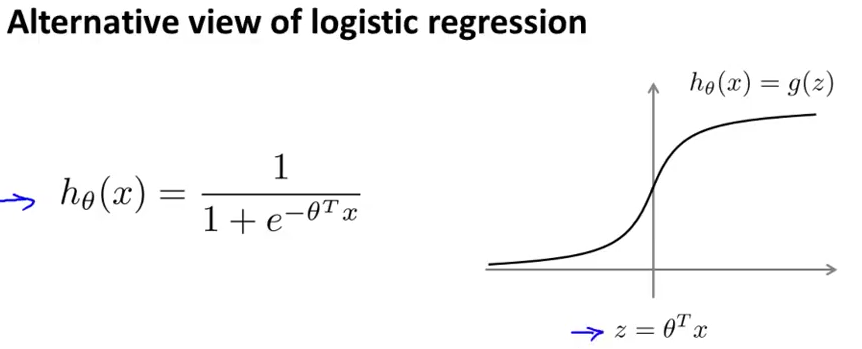
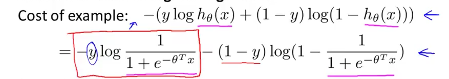
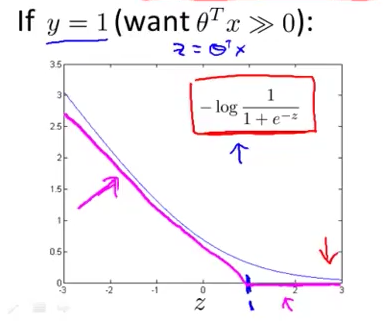
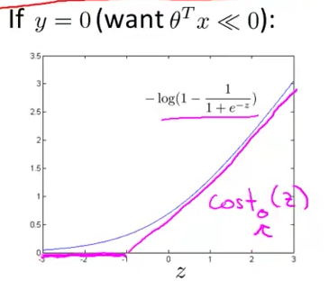
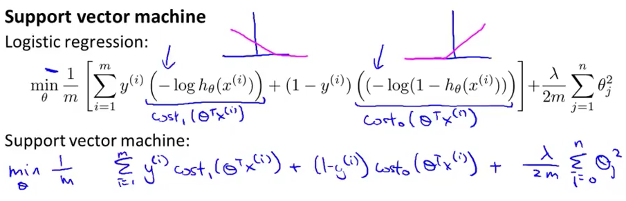
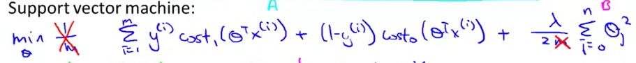
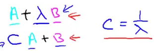
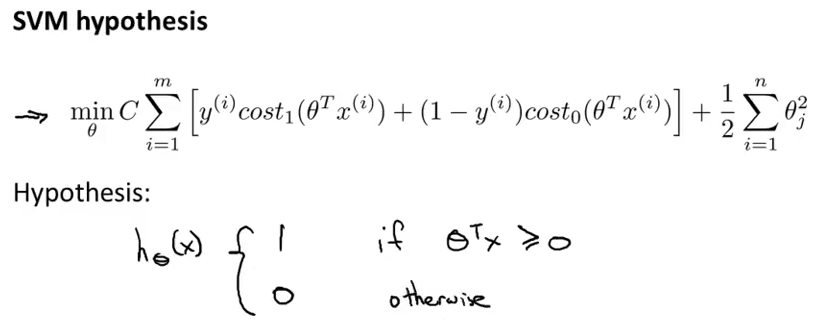

# 1. Optimization Objective
Created Saturday 25 July 2020

* Alternative view of logistic regression.

* If we have y=1, we want h() to be 1, i.e z >> 0, i.e e^-z^ be very small.

We know, about the cost function for logistic regression

here, we can assume the slope to be (pink-straight line curve):
 

* We name these functions cost1 and cost0.
* We can now, **build **SVMs:
	1. We write the cost function for logistic regression, by placing cost0 and cost1

2. We get rid of the 1/m terms. This is easy because m is a constant being multiplied, i.e it does't affect the minimization process

3. We can write the cost for the support vector machine. Traditionally it is changed to look like CAB, where c = 1/λ

4. Unlike the logistic regression, the SVM gives a binary output, because it is not a rounded curve:

