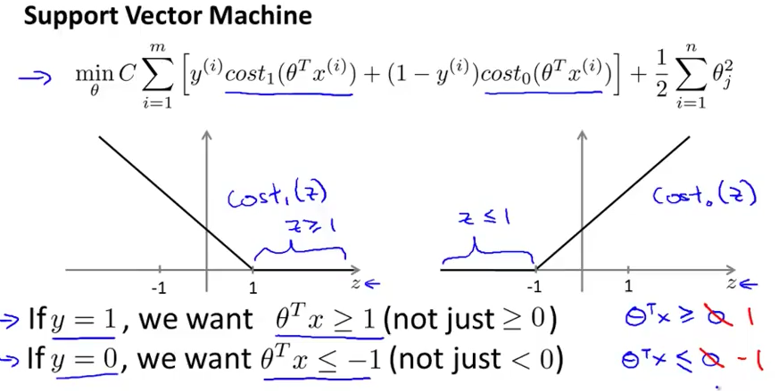
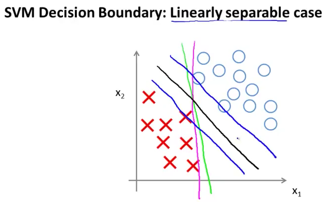
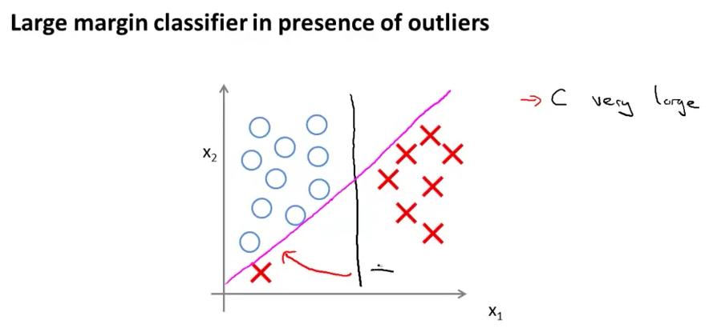

# 2. Large Margin Intuition
Created Saturday 25 July 2020

* Sometimes SVM's are called Large Margin classifiers, why?

* In an SVM, the decision boundary values are 1 and -1, rather than 0. This means that an SVM makes a decision much more selectively, and consequently it's decision is of greater intrinsic value, than a logistic regression model. i.y h≥1 if y=1 and h≤-1 if y=0 rather than just y=1 and y=0.

* SVM decision boundaries maintain a large margin, when compared to a logistic regression model's decision boundary.
* If there are large boundaries, what about the case when we have outliers?

* If C is very large, i.e λ is very small, we have a large contortion. If C is moderate, the decision boundary will not shift so drastically..

