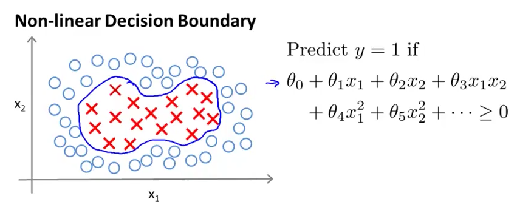
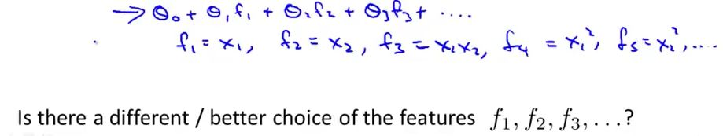
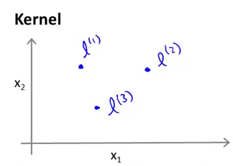
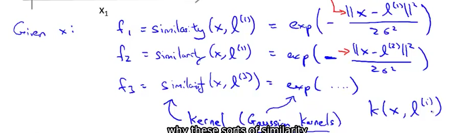
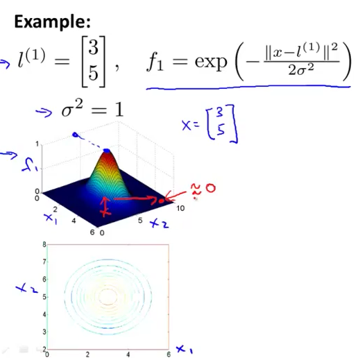
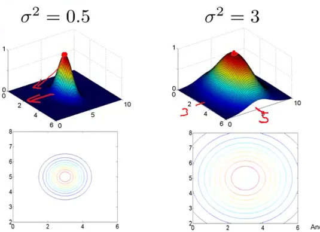
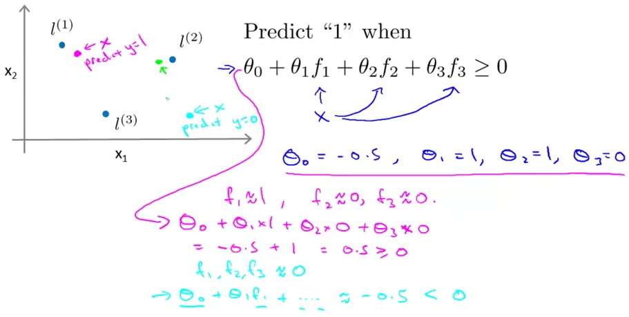
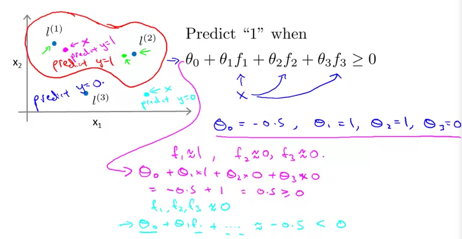

# 1. Kernels 1
Created Saturday 25 July 2020

Kernels - Help in using SVM.

One way to get this is to have complex polynomial features.

* We talked about CV, we saw that there are many higher order polynomial terms.
* Kernels are a new idea, which help us define new, more useful features for our hypothesis:

We choose some points, called landmarks, and check their similarity with the chosen feature values function value(kernel values)
 

* Here we choose gaussian kernels. It varies is less.

* We pick the ones with kernel values near 1. i.e they represent the situation as good as the feature does.

* We can then get the decision boundaries by making our hypothesis as a weighted sum of kernel functions and features.

