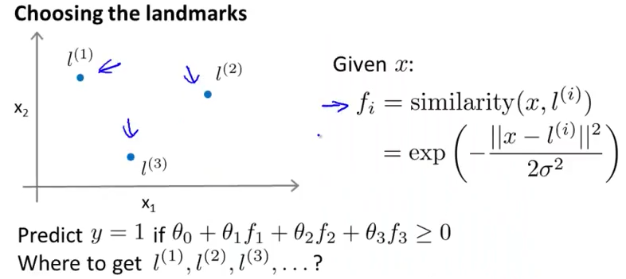
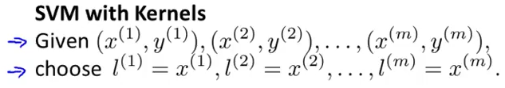
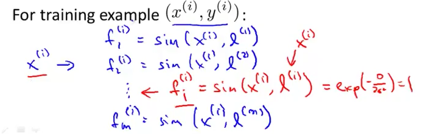
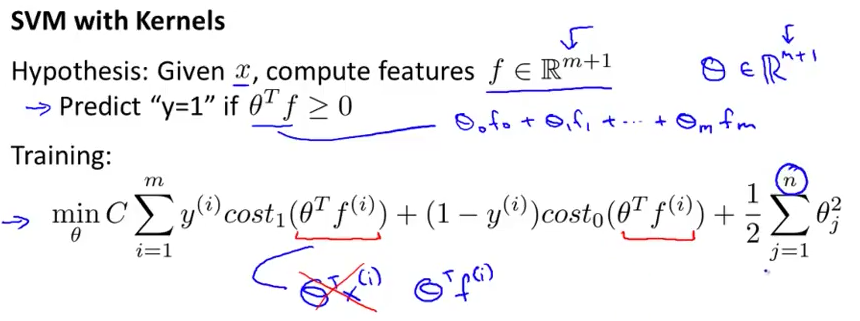
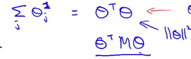
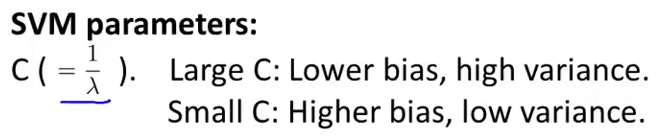
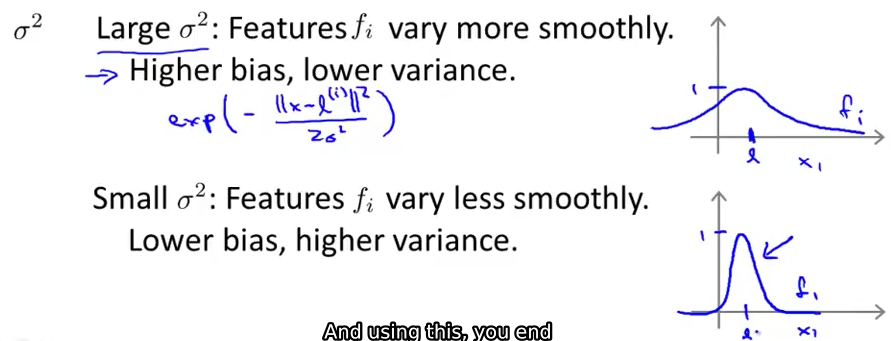

# 2. Kernels 2
Created Tuesday 28 July 2020

* We did this using kernels.

* How do we choose the landmarks? And we need many of them, so handpicking is not useful.
	1. We choose the landmarks same as that of training example.

2. Then we can calculate the similarities w.r.t some example x. One will be useless, that's okay.

We have a vector of the similarity values.
We use this as the feature weights. It works.

3. We set the hypothesis as:

* Note: While implementing SVM, the regularization term is handled somewhat differently. This allows SVM to scale better. M is decided somehow, we don't need to solve them. M just helps in the optimzation process.

* Can we apply kernels to other algorithms: Yes we can, but it won't be computationally feasible except for SVMs.

*****

* How to parameters: 
	1. C = 1/λ ?

2. σ^2^

