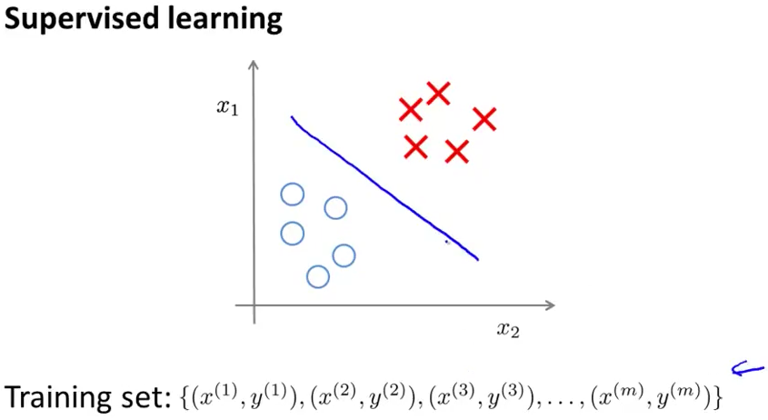
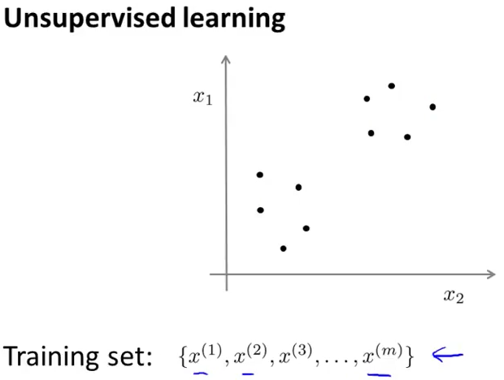
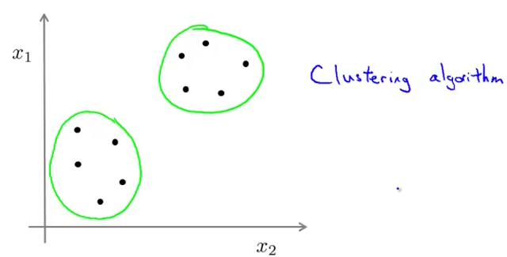
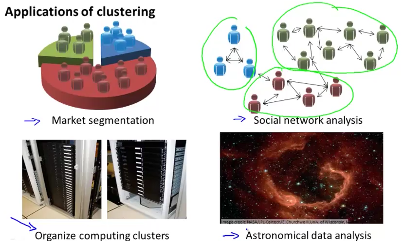

# 1. Unsupervised Learning Intro
Created Thursday 30 July 2020

* We don't have labeled(answers) datasets, in unsupervised learning.

 

* We need to find some structure in the data.
* Clustering is an example of unsupervised learning.

*****

where are clusters used:

1. Market Segmentation.
2. Social Network Analysis.
3. Organize computer clusters.
4. Astronomical data analysis.

