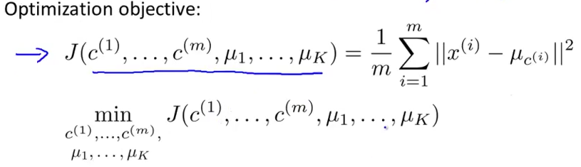

# 3. Optimization Objective
Created Friday 31 July 2020

* All the unsupervised learning algorithms also have a optimization function.
* This will be useful for two reasons:
	1. We can troubleshoot k-means while running.
	2. We can find better clusters and avoid local optima.

*****

We keep track of two things:

1. Color of a point, i.e it's representative cluster centroid. μ~c~^(i)^
2. Cluster centroids(k of them)

This cost function is also called the **distortion function**. The coloring step can be shown to be the minimizing step. The move step further minimizes the cluster centroids w.r.t yo the populations.

