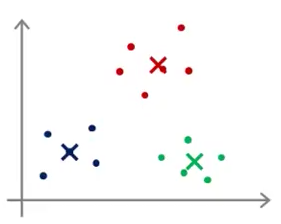
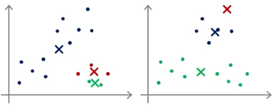

# 4. Random Initialization
Created Friday 31 July 2020

The first step in K means was random initialization of the cluster centroids.

* Randomly pick k training examples as cluster centroids. Set them qual to th e data points. Recommended.
* K means can stop at different solutions depending on initialization. It can even stop at a local optima.

 
Good k-means.						Bad k-means.

* To avoid this, run k-means multiple times. Pick the case with the lowest cost. This works best for small clusters(k=2 to 10).

