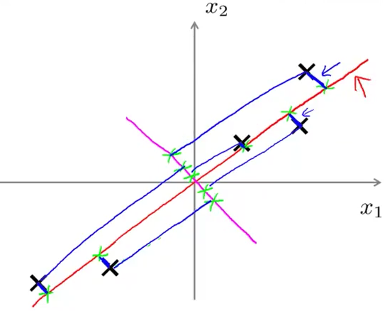
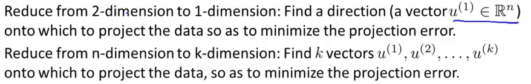
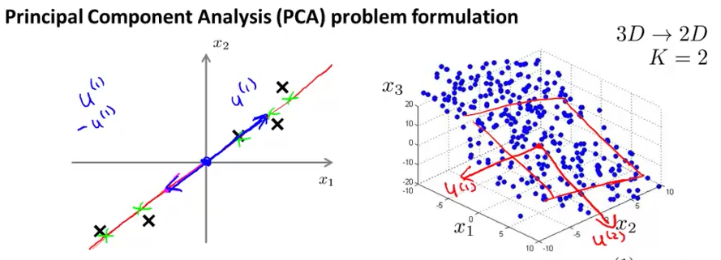
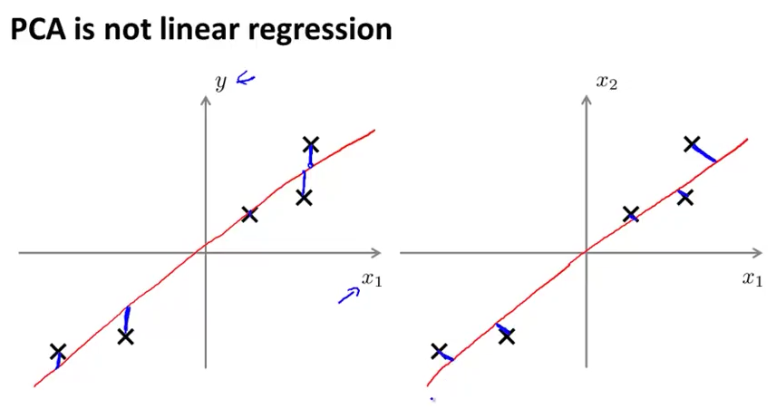

# 1. PCA - Problem Formulation
Created Friday 31 July 2020

PCA(**Principle Component Analysis**) is an algorithm for dimensionality reduction. 
Let's formuate what we'd like PCA to do.

* Mean normalization should be done before performing PCA.

PCA choosen a low dimensional surface.

The small blue line(⊥ to red line) are called the projection errors.

* PCA **is not** linear regression(regression on the left). They are actually very different.

