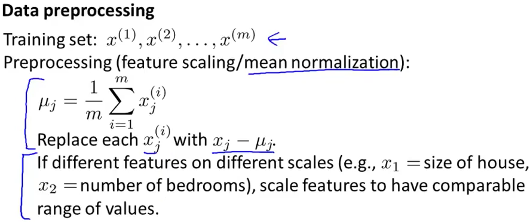
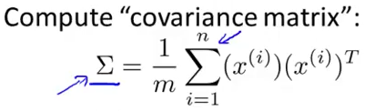
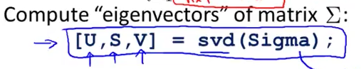
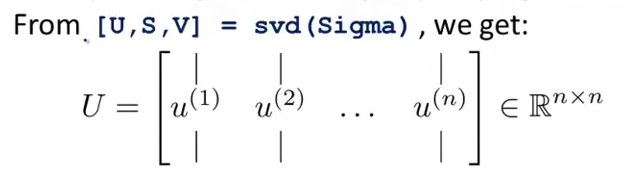
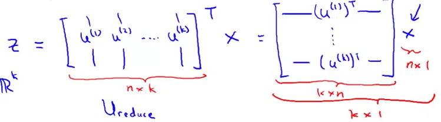

# 2. PCA - algorithm
Created Friday 31 July 2020

* There's a data preprocessing step - feature scaling/mean normalization.

*****

Steps for PCA:

1. Find the Covariance Matrix

2. Compute the eigen vectors

We only need the U matrix, it will contain the vectors, for the n-space(output).

3. We take the first k vectors(columns of the U matrix) - called U~reduce~

	

