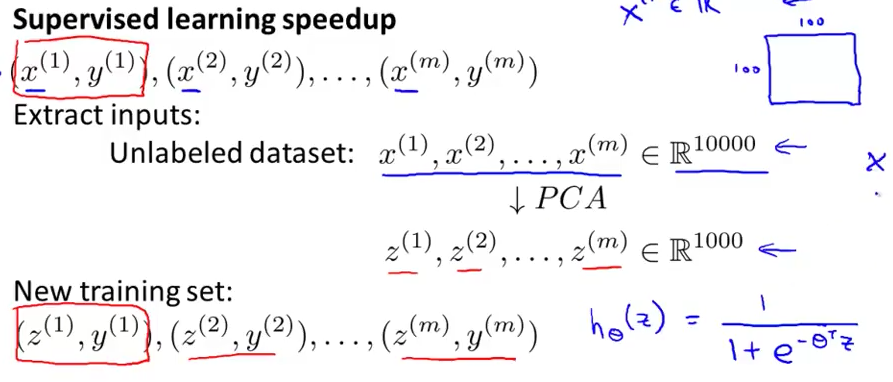

# 3. Advice for applying PCA
Created Friday 31 July 2020

* Using PCA to speedup learning algorithms:

* Lowering dimensions reduces computation making the algorithm be faster.

*****

* PCA should be run only on the training set, not the CV or test set.
* We can reduce the dimesnions by 10x, 5x - this is normal.

*****

PCA myths:

1. It is a bad practice to use PCA to reduce overfitting. Use regularization.
2. It's better to avoid PCA if possible.

