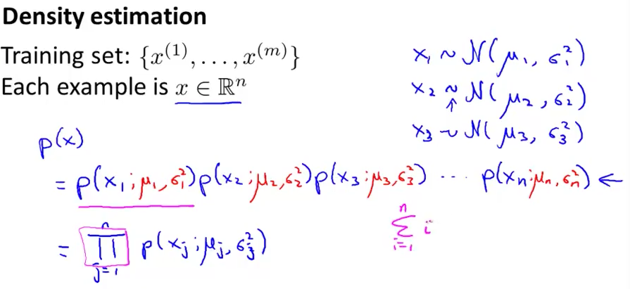
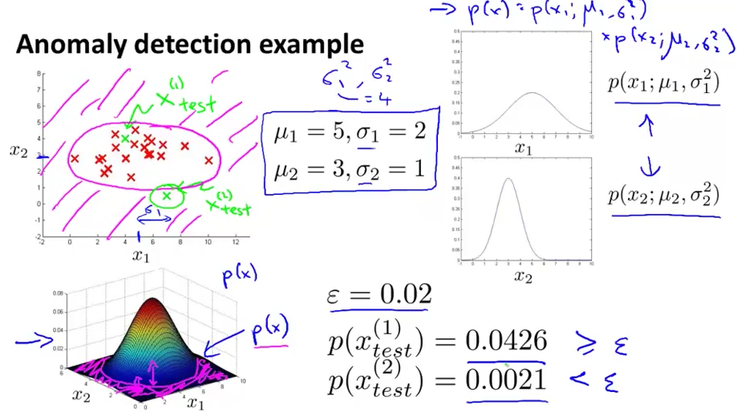

# 3. Anomaly Detection - Algorithm
Created Saturday 01 August 2020

We are going to model P(x) from the given data.
P(x) = p(x~1~)p(x~2~)...p(x~n~)

The different μs and σs correspond to the different features. We can vectorize it.
An example - probability(higher is better)

