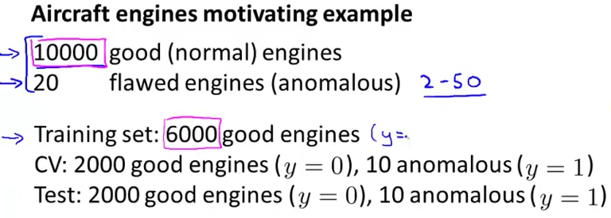

# 1. Developing and evaluating anomaly detection
Created Saturday 01 August 2020

* We need a single metric for system evaluation.
* Assume we have labelled data of some examples.

Steps:

1. We select an unlabelled data set as the test set.
2. We select some labelled CV and test set.

Evaluation metrics:

1. True +ve, false +ve, true -ve, false -ve
2. Precision/recall
3. F~1~ score

